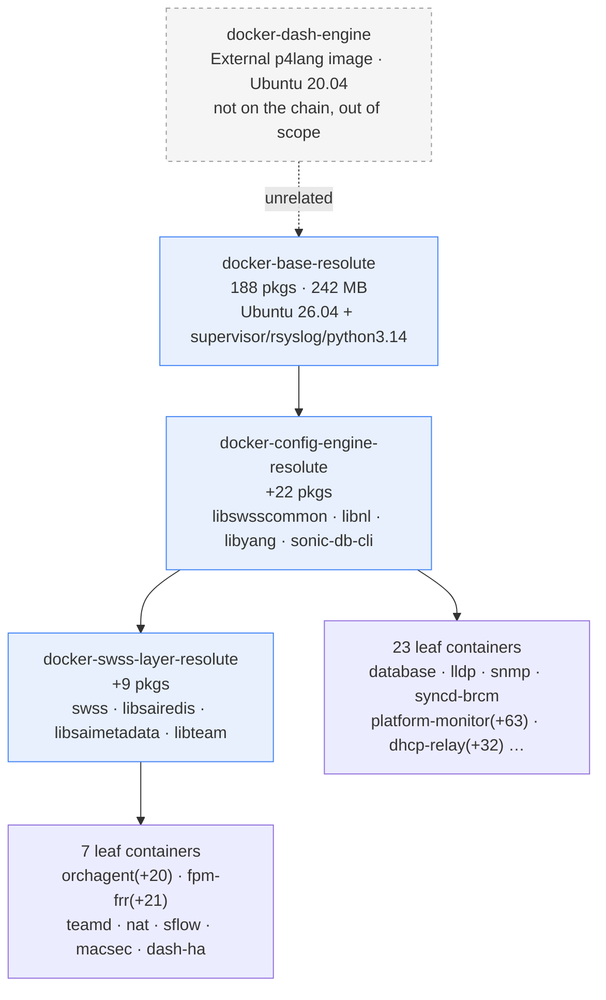
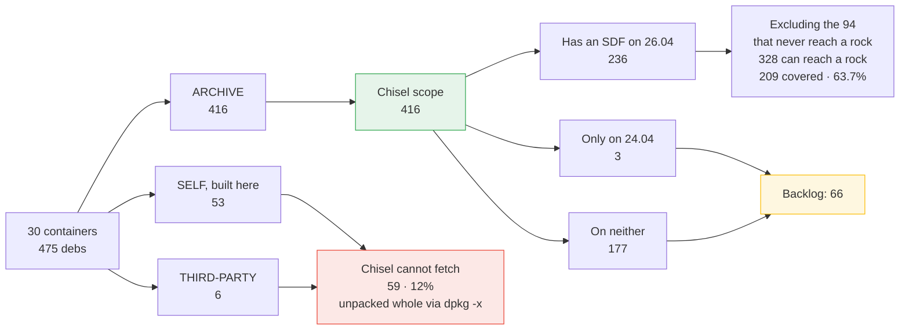
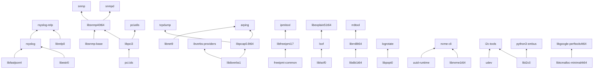

# Chisel Slicing Blueprint for resolute SONiC

**Date**: 2026-09-21
**Scope**: **cutting the Ubuntu archive packages that SONiC containers use into chisel slices**, delivered upstream to the `ubuntu-26.04` branch of `canonical/chisel-releases`
**Not covered**: how those slices get used inside rocks. That is part two, summarised in section 8
**Nature**: a work blueprint for assignment, scheduling and acceptance. Evidence and measurement definitions are in the appendix; the body says only what to do
**Premise**: chiselling is a direction already set above this team. This document plans how, not whether
**Valid as of**: package inventory and coverage collected 2026-09-17; downstream rock branch facts at `3e81d8aa2f` (2026-09-18)

---

## Summary

| Question | Answer |
|---|---|
| How many packages are in play? | Of the 475 debs the containers use, **416** are in the Ubuntu resolute archive, which is chisel's scope. Another 53 are self-built and 6 are third-party binaries, which chisel cannot fetch |
| How much has upstream already sliced? | Of the 328 packages that could reach a rock, **209 are covered, 63.7%**. The heaviest base-layer packages are all in place |
| How many must we write? | **65 to 67 items**: amend 1 existing SDF, forward-port 3 from 24.04, write 61 to 63 new ones |
| Which are most urgent? | **10**, which block the four already-migrated containers. The other 54 are an **upper bound** for the 26 unmigrated ones, not a commitment |
| Can work start now? | **Yes.** This part depends on no progress in the rock branch; it only needs a working `chisel` and `spread` environment |
| Biggest risk? | Not upstream review, since the fork keeps delivery unblocked. It is that the fork has an owner but **no operational agreement** around it (5.5) |
| How long | **Two tracks** (5.1). Rock delivery does not wait for upstream merges, since the fork serves them, and is a matter of **weeks**. Upstream convergence is **11 to 32 weeks** for the first 22, or 35 to 55 for all 66, depending on the reviewer attention we obtain |

---

## 1 · Where this document sits

The whole effort divides in two, and the halves differ in repository, deliverable, reviewer and timescale:

| | **Part one: cutting slices (this document)** | Part two: using chisel in rocks |
|---|---|---|
| Repository changed | `canonical/chisel-releases`, branch `ubuntu-26.04` | `canonical/sonic-buildimage`, branch `202605_resolute_rock` |
| Deliverable | An SDF (`slices/<pkg>.yaml`) plus a spread test | rockcraft recipes, pebble services, build integration |
| Who reviews | Canonical upstream, at a pace we do not control | Our own team, alongside the branch's existing author |
| Skills needed | Debian packaging, the chisel format, upstream review | rockcraft, pebble, the SONiC build system |
| Depends on | **Nothing in part two.** Can start immediately | The slices part one produces |

**Why cut it this way**: when the two are mixed horizontally, a boundary like "we edit `stage-packages`, they own `services:`" does not hold, because swapping in a slice also disturbs the recipe's `organize:`, its `prime:` filters and its unchiselled list, all of which belong to the recipe author. Cut vertically, part one becomes a supply line that advances independently and part two consumes it at its own pace.

**Who consumes it**: branch `202605_resolute_rock` has four containers migrated to rockcraft plus pebble on the `base: bare` chiselled-distroless path. Only `docker-database` is genuinely chiselled, and its recipe contains a part named, literally, `install-unchiselled-packages` — **that is the empirical source of this backlog**, since the author adds a line every time a package has no slice. Part two's detail is in section 8.

---

## 2 · Three diagrams

### 2.1 The container inheritance chain, and why a shared-layer package multiplies by 30



The three blue layers never run on their own, yet every package in them is inherited verbatim below. **The base and config-engine packages appear in all 30 containers**, so one missing shared-layer SDF is 30 rocks missing it at once.

### 2.2 Four package origins, of which chisel governs two



The orange box, **66 packages, is the entirety of task one**. The red 59 are chisel's hard boundary and nobody has decided who handles them (see 7.1).

### 2.3 Dependencies inside the backlog: 22 edges set the merge order

Chisel resolves an SDF's `essential:`, so **the dependency must merge first** or the dependent cannot validate against the target branch.



Arrows point at the package that needs them, so **the tail merges first**. This overturns a pure priority-score ordering: `rsyslog` scores second but must wait for `libestr0` and `libfastjson4`, landing eighteenth. The full topological order is in 5.4.

---

## 3 · Scope and measurement

### 3.1 Which packages are chisel's business

Across the 30 containers on the SONiC base chain, the packages dpkg records fall into four origins (definitions in 7.1):

| Origin | Count | Ours? |
|---|--:|---|
| ARCHIVE (present in the resolute archive) | 416 | **Yes** |
| SELF (built from source here) | 53 | No, not in any chisel archive |
| THIRD-PARTY (downloaded binary debs) | 6 | No, same reason |

**Scope is the first two rows, 416 packages.**

**But the exclusion leaks**: the self-built debs depend on archive libraries such as libhiredis, libzmq5, libboost and libnl3, and the wheels depend on libpython3.14 and python3-cffi-backend. Those archive packages are exactly the ones on this backlog. **The excluded set determines which slices are needed**, so its version drift is in scope whether this document wants it or not.

**Architecture boundary: all evidence is amd64.** The archive indices are `binary-amd64` and the `ld.so` conclusion rests on `/usr/lib/x86_64-linux-gnu`. Upstream SDF CI validates across six architectures, so **contents and paths must be rechecked on other architectures before submission**, or an SDF verified only on amd64 may fail review.

### 3.2 Where the backlog comes from

Two criteria, used together but kept distinct:

- **The four migrated containers**: read the recipe's `install-unchiselled-packages`. If the package already has an SDF on 26.04 it is not our problem (swapping it in is part two); if not, it goes on the backlog. This produces 3.3, and it is **measured**.
- **The 26 unmigrated containers**: only the Docker image inventory is available. That estimate is **systematically too large**, because migration drops `-dev` packages, package-manager tooling and the whole supervisord python dependency chain. It yields an **upper bound** for scheduling, not a commitment. This produces 3.4.

`syncd-vs` and `gbsyncd-vs` are an exception: they carry 128 packages and 750 MB above their parent because one `apt-get install` mixes build and runtime dependencies. No SDFs are written for that collateral; it resolves itself when the recipe author enumerates `stage-packages` from scratch.

### 3.3 The backlog must be dependency-closed

`install-unchiselled-packages` lists only what the recipe author wrote down explicitly, never the transitive dependencies, because apt resolves those when a package is installed whole. But when we write an SDF for one of those packages, **chisel resolves the SDF's `essential:` instead, which requires an SDF for each dependency.**

`librelp0` fell through exactly that gap: `rsyslog-relp` depends on it hard (`Depends: librelp0 (>= 1.5.0)`), it has no SDF, and because it was absent from the recipe list it dropped out of the backlog entirely. Rechecking on the same basis also restored `libpopt0` (a hard dependency of `logrotate`) and `libprotobuf32t64`.

A closure script has been run (63 seeds expanding to 215 packages, see 7.4), but the list itself is still a hand-maintained table, **so the figures in 4.3 and 3.4 should be read as lower bounds**. Before work starts, the closure computation should become a script wired into CI so the backlog is generated from a dependency graph. Otherwise the same class of omission recurs.

---

## 4 · Task one: author all 66 SDFs in the fork

**Deliverable**: 66 SDFs plus spread tests, on the `ubuntu-26.04` branch of our chisel-releases fork.
**Done when**: every package installs under `chisel cut`, passes its chroot functional check, and its spread test actually runs and passes.
**Bottleneck**: none external. An AI can run these in parallel; the order of magnitude is **weeks**.
**What it blocks**: part two's rockification. This is the critical path for rock delivery.

### 4.1 How to author: use the chisel-slicer skill, do not invent a second process

`canonical/mason`'s `chisel-slicer` skill defines the full ten-step workflow (validate, dependency tree, per-package inspection, match existing slices, design, write, lint, spread test, verify against docs, two commits). Install it as `AGENTS.md` on `ubuntu-26.04` describes (`npx tessl i canonical/mason --skill chisel-slicer`); that file requires using it for slice work.

**Format constraints, tool usage, slice naming, testing depth and commit conventions all follow the skill**, which this document does not restate. When the skill changes, it is the single authority.

**One property worth knowing: SDFs carry no version numbers.** All 694 have exactly three top-level fields, `package:`, `essential:` and `slices:`, with no version constraints anywhere. Versions live in two other places: `chisel.yaml` pins the suites (`resolute`, `-security`, `-updates`) and the archive, and the digits inside package names (`libpython3.14`, `libboost-serialization1.83.0`, `libsnmp40t64`) are sonames rather than constraints.

That cuts both ways. An SDF does not break merely because the package received an SRU, as long as the file paths held. But **if a path does change, it fails silently**: `chisel cut` reports a missing file and no version metadata warns you in advance. That is why the churn criterion in 5.4 matters, and why fork SDFs need retesting against the upstream archive.

**Environment prerequisite: both `chisel` and `spread` are needed.** chisel via snap, spread needs an lxd or docker backend. **Both, not just chisel** — the skill requires a spread test that actually runs and passes before a commit, so installing only chisel leaves that criterion empty.

### 4.2 The four things that are ours rather than the skill's

**One, every query must be pinned to resolute.** `_deb-list.py` reads the suite from `chisel.yaml`, but `apt-cache depends` reads whatever apt sources the executing environment has. If that machine runs a different Ubuntu release, both the dependency tree and the file listing come back wrong, and `check-slice.py` cannot detect it; only upstream CI will. **The three 24.04 forward-ports in 5.5 are the likeliest place to trip**: paths written from a 24.04 deb may not exist in resolute at all.

**Two, the dependency closure is already computed, so use it.** See 4.6: 66 is the complete set and the 22 internal edges are listed. There is no need to rerun `apt-cache depends --recurse` per package.

**Three, the ordering of `logrotate` and `cron-daemon-common`.** One of the skill's listed rejection reasons is shipping a config file for a tool that is not itself sliced. Both packages are on the backlog, so do not carry a drop-in for another tool when writing the `logrotate` SDF.

**Four, `util-linux` is a slice addition, not a new SDF.** Published slices are append-only, so adding a `logger` slice is the right shape; do not modify any of its existing slices.

### 4.3 The backlog

### 4.4 Amend one existing SDF (1 item)

| Package | What to add | Evidence |
|---|---|---|
| `util-linux` | A `logger` slice carrying `/usr/bin/logger` | 43 container-side scripts call it; the current SDF omits it (2.7) |

The smallest change and the form of PR upstream accepts most readily. **Submit it first, to clear CLA, CI and review.**

`mawk`'s missing `/usr/bin/awk` is the same class of problem, but standardising recipes on `gawk_bins` sidesteps it without waiting for upstream, so it is not on the backlog. The backlog package `ndisc6` also needs `/usr/bin/traceroute6`, which is simply included when we author it.

### 4.5 Forward-port from 24.04 (3 items)

| Package | 24.04 SDF lines | Evidence |
|---|--:|---|
| `rsyslog` | 49 | Every container starts `rsyslogd -n -iNONE`, and all four recipes install it whole |
| `libestr0` | 15 | rsyslog dependency |
| `libfastjson4` | 15 | rsyslog dependency |

Forward-porting is **adaptation, not copying**: check usrmerge paths, `t64` renames, the conversion of `essential:` from list to map (26.04 is v3, where the list form is an outright parse error), and changes in the `.deb` contents themselves.

### 4.6 Measured as missing on the migrated containers (10 items)

Deduplicating the `install-unchiselled-packages` parts of the four recipes and keeping only what has no SDF. **`rsyslog` overlaps with 4.5, and `net-tools` and `libdaemon0` fall away under the default below, so the net figure for new SDFs is 7 to 9.**

| Package | Appears in | Note |
|---|---|---|
| `rsyslog`, `rsyslog-relp` | all four | `rsyslog` is in 4.5; `rsyslog-relp` is required, since the configuration really does carry `module(load="omrelp")` |
| `librelp0` | not in any recipe list | A hard dependency of `rsyslog-relp` (`Depends: librelp0 (>= 1.5.0)`). It never appears in the recipe lists because apt resolves it when the package is installed whole, but once we write an SDF for rsyslog-relp its `essential:` needs an SDF for librelp0 |
| `libpython3.14` | database, router-advertiser | C extensions link against it |
| `python3-yaml`, `python3-redis`, `python3-cffi-backend` | eventd, router-advertiser, mgmt-framework | python dependencies installed as debs |
| `net-tools` | eventd, router-advertiser, mgmt-framework | **Questionable**: no runtime caller on the Docker side, so it looks inherited from the noble list. Confirm with the recipe author before starting |
| `libdaemon0` | eventd, router-advertiser, mgmt-framework | **Questionable**: as above |
| `radvd` | router-advertiser | Required |

**These are the most urgent**, because they block containers already in progress. If `net-tools` and `libdaemon0` turn out to be inherited, the bucket drops from 9 to 7.

**A methodological caution (not yet fully honoured here, see below)**: `install-unchiselled-packages` lists only what the recipe author wrote down explicitly, never the transitive dependencies, because apt resolves those when a package is installed whole. But when we write an SDF for one of those packages, chisel resolves the SDF's `essential:` instead, which requires an SDF for each dependency. `librelp0` fell through exactly that gap. **The backlog must be dependency-closed rather than hand-maintained.** Rechecking on that basis also restored `libpopt0` and `libprotobuf32t64` to 2.4. `python3-async-timeout` is an alternation dependency of `python3-redis` (`python3-async-timeout | python3-supported-min`) that python3.14 should already satisfy, so it is left off the list but must be confirmed when the SDF is written.

The list is currently a hand-maintained table rather than tool-generated, **so the figures in 3.3 and 2.4 should be read as lower bounds**.** Before work starts, the closure computation should be turned into a script and wired into CI so the backlog is generated from a dependency graph. Otherwise the same class of omission recurs.

### 4.7 Upper bound: the 26 unmigrated containers (about 54 items)

Estimating from the Docker inventory, minus the packages that never reach a rock, the 26 unmigrated containers may need about 54 more SDFs (`radvd` is in 4.3 because router-advertiser is already migrated). The main entries by number of beneficiaries:

| Tier | Packages |
|---|---|
| Several containers | `libpci3`, `pci.ids`, `libibverbs1`, `libpcap0.8t64`, `libprotobuf32t64` (swss-layer, 14 containers), `libprotobuf-lite32t64`, `ibverbs-providers`, `libsnmp-base`, `libsnmp40t64`, `python3-protobuf`, `tcpdump` |
| Two containers | `bridge-utils`, `conntrack`, `dmidecode`, `ethtool`, `freeipmi-common`, `ipmitool`, `libfreeipmi17`, `lsof`, `liblsof0`, `pciutils`, `python3-netifaces` |
| platform-monitor only (14) | `udev`, `smartmontools`, `nvme-cli`, `libnvme1t64`, `i2c-tools`, `libi2c0`, `rrdtool`, `librrd8t64`, `libdbi1t64`, `psmisc`, `uuid-runtime`, `xxd`, `python3-bottle`, `python3-smbus` |
| orchagent only (5) | `arping`, `libnet9`, `ndisc6`, `ndppd`, `ifupdown` |
| fpm-frr only (6) | `libgoogle-perftools4t64`, `libtcmalloc-minimal4t64`, `libpcre2-posix3`, `logrotate`, `libpopt0` (a hard dependency of logrotate), `cron-daemon-common` |
| Remainder | `snmp`, `snmpd` (snmp); `libexplain51t64`, `libjsoncpp26` (dhcp-relay); `kmod`, `lz4` (syncd-brcm); `libdbus-c++-1-0v5` (sysmgr) |

**This is an upper bound, not a commitment.** The noble branch's experience shows that a recipe lists fewer runtime dependencies than the Docker image installs. Reconfirm each container against the migrated-container criterion of 3.2 once its recipe exists.

Complexity distribution: roughly two thirds are plain libraries (`libs` plus `copyright`, against a 26.04 median of 17 lines). The remaining third carry configuration or data and need finer decomposition and more substantial spread tests: `udev`, `snmpd`, `rrdtool`, `smartmontools`, `ipmitool`, `logrotate`, `radvd`, `tcpdump` and `ifupdown`.

---

---

---

---

## 5 · Task two: push the SDFs upstream

**Deliverable**: 66 SDFs merged into `canonical/chisel-releases` on `ubuntu-26.04`, and on the other maintained release branches.
**Done when**: a recipe can move the package from `override-build` back to `stage-packages`.
**Bottleneck**: upstream review throughput, which we do not control. The order of magnitude is **months**.
**What it blocks**: nothing in rock delivery. It decides how long we carry the fork.

**The two tasks run fully in parallel**, and task one waits on nothing in task two. Treating them as one piece of work produces the wrong schedule.

### 5.1 Where it stands: 19 submitted, none merged

**jy5275 has already opened 20 PRs against chisel-releases covering 15 packages, every one inside this document's backlog with no divergence either way. This is not a proposal awaiting a start; it is under way.**

| PR | Branch | Packages | Age | State |
|---|---|---|--:|---|
| #1104 | 26.04 | rsyslog and rsyslog-relp (12 files) | 53 days | open, 5 reviews |
| #1109 | 26.04 | rsyslog-relp and dependencies | — | closed as a duplicate of #1104 |
| #1112-#1115 | 26.04 | libdaemon0, net-tools, python3-yaml, python3-redis | 51 days | all open |
| #1116-#1119 | **26.10** | the same four | 51 days | all open |
| #1139, #1140 | 26.04, 26.10 | libpython3.14 | 40 days | open |
| #1163-#1171 | 26.04 | bridge-utils, pciutils, smartmontools, tcpdump, arping, ipmitool, radvd, python3-protobuf, python3-smbus | 20 days | all open |

**Nineteen open, one closed, none merged.** The oldest has been waiting 53 days.

That changes several things:

1. **The range in 5.4 is no longer a projection but a floor.** We have been in the queue 51 days with nothing merged, so the "11 weeks with exclusive capacity" row is wishful. Reality is at or worse than the FIFO row.
2. **jy5275 is already mirroring to 26.10.** That confirms the cross-release forward-porting rule of 5.4 applies in practice: PR count multiplies by the number of maintained branches rather than being one per package.
3. **The backlog is independently validated.** These 15 packages match the section 3 list exactly, with none outside it, which confirms the criterion in 3.2.
4. **Duplicate submission has already happened once.** #1109 was closed after colliding with #1104. Before submitting any of the 51 remaining packages, check whether someone upstream is already doing it: `udev` already has PR #378 open, for instance.

**So the immediate priority on track B is not opening more PRs but getting the 19 already open to merge.** Adding to the queue before it drains only lengthens it.

### 5.2 The measured upstream rhythm

On 2026-09-21 the GitHub API gave the last 100 merged PRs on chisel-releases and every currently open one:

| Measure | Observed |
|---|---|
| Merge latency | Median **3.7 days**, P75 16.4, P90 26.4, longest 64 |
| Merge rate | 6.1 PRs/week across all branches; **only 1.9/week on `ubuntu-26.04`** |
| Current backlog | 100+ open, median age **46 days**, 61 older than 30, oldest 600 |
| On 26.04 | **39 open**, 89% marked `REVIEW_REQUIRED` |
| PR shape | Median **2 files changed** (an SDF and its spread test); 2 of 100 titles list more than one thing |
| Contributor concentration | One person accounts for 48 of 100 |

**PRs essentially never bundle packages.** The large ones (61 files for `gcc`, 23 for `binutils`) are a single package across architectures. One package per PR is the established upstream shape, not our choice.

**Read these numbers carefully, because they are weaker than they look:**

- `REVIEW_REQUIRED` only means "not yet approved", not "the author has nothing left to do". Failing CI, requested changes and draft status all produce it. Using it to argue the bottleneck sits on the review side is **an overreach**.
- Merge latency covers only PRs that merged, so it excludes the stalled population entirely. That is survivorship bias, and the real submission-to-landing distribution is worse than 3.7 days.
- 1.9 PRs/week is a historical **departure rate** limited by how many people contribute, not a ceiling on review capacity. Submitting more will not necessarily queue linearly against it.

Establishing these properly would mean measuring ready-for-review to first review, author response time, approval to merge, and the closed-unmerged population. This round did not.

### 5.3 How long it takes: a range, not a number

Two assumptions are easy to make when working back from a merge rate: that we get the branch's entire capacity, and that no queue sits ahead of us. Neither holds, so the answer is a range rather than a single number:

| Calculation | Result | What it assumes |
|---|--:|---|
| 22 ÷ 1.9 | 11 weeks | We get all of 26.04's capacity and jump ahead of the 39 open PRs |
| (39 + 22) ÷ 1.9 | **32 weeks** | Strict FIFO, with us behind the existing backlog |
| 22 ÷ (1.9 ÷ 2) | 23 weeks | We get half the capacity |

**The real figure lies between 11 and 32 weeks, and it turns on something this document does not control: how much reviewer attention we obtain.** GitHub review is not FIFO, so 32 weeks is not a hard ceiling either, but quoting 11 as the expectation would be dishonest. **Any external commitment should carry the range rather than its lower bound.**

All 66 on the same arithmetic is 35 to 55 weeks.

### 5.4 Push order

Since all 66 go upstream eventually, the question is sequence. Three criteria, scored:

- **Cost of keeping it in the fork (heaviest weight).** When a package gets an SRU, the fork's SDF may need changes and retesting. Measured, only **9 of the 66** appear in `resolute-updates` or `resolute-security`. **Those nine are the most expensive to hold and should leave first.**
- **Probability of being overtaken.** The more archive packages depend on it (`rdep`), the likelier upstream slices it themselves. Once upstream accepts a same-named SDF with a different decomposition, our fork version conflicts with it.
- **Future migration cost.** Container count sets how many references change on the day a slice moves upstream. It is a one-off cost, so it carries the least weight.

The top 22 by that score:

| Priority | Package | churn | rdep | Containers | Main reason |
|--:|---|---|--:|--:|---|
| 1 | `libpython3.14` | security | 279 | 30 | High on all three |
| 2 | `rsyslog` | security | 49 | 30 | Security updates and used everywhere |
| 3 | `rsyslog-relp` | security | 0 | 30 | As above |
| 4 | `udev` | security | 85 | 1 | Security updates, and upstream will likely slice it anyway |
| 5 | `freeipmi-common` | security | 39 | 2 | Security updates |
| 6 | `libfreeipmi17` | security | 24 | 2 | Security updates |
| 7 | `uuid-runtime` | security | 16 | 1 | Security updates |
| 8 | `xxd` | security | 3 | 1 | Security updates |
| 9 | `python3-yaml` | — | 404 | 30 | Among the highest overtaking risk |
| 10 | `dmidecode` | updates | 14 | 2 | Has updates |
| 11 | `kmod` | — | **1279** | 1 | Highest overtaking risk |
| 12 | `libpopt0` | — | 124 | 30 | |
| 13 | `libpcap0.8t64` | — | 168 | 4 | |
| 14 | `libpci3` | — | 160 | 5 | |
| 15 | `net-tools` | — | 47 | 30 | Skipped if the 3.3 default stands |
| 16 | `libprotobuf32t64` | — | 95 | 14 | |
| 17 | `python3-redis` | — | 26 | 30 | |
| 18-22 | `libdaemon0`, `libfastjson4`, `libestr0`, `python3-cffi-backend`, `librelp0` | — | low | 30 | High container count means high future migration cost |

**Note that the churn criterion overturns the intuitive ordering.** `freeipmi-common`, `libfreeipmi17`, `dmidecode`, `uuid-runtime` and `xxd` all look marginal, with one or two containers and low `rdep`, but they carry security updates and are therefore the most expensive to hold in the fork, so they come first. `libibverbs1`, `libjsoncpp26`, `psmisc` and `logrotate` have respectable `rdep` yet no churn, so they can wait. **Sorting by container count or by `rdep` alone gets both groups wrong.**

Two further points:

- **`util-linux` is not in this table**, because it adds a slice to an existing SDF (3.1) rather than writing a new one. It should still be submitted first, as the smallest change that proves the process. So the top 22 plus it is **23 PRs**, or **21** if the 3.3 default removes `net-tools` and `libdaemon0`.
#### The dependency closure is done

A full `Depends` closure over the 66 backlog packages, taking only the first alternative and ignoring `Recommends` and `Suggests`:

- **The closure adds only 3 packages**, none of which needs an SDF. `adduser` and `debconf` are used only by maintainer scripts, which chisel does not run and whose dependencies the skill says to drop, and `python3-async-timeout` is the first alternative of `python3-async-timeout | python3-supported-min`, which python3.14 satisfies. **So 66 is the complete set.**
- **There are 22 dependency edges inside the backlog**, which must merge leaves-first:

```
rsyslog        <- libestr0, libfastjson4        rsyslog-relp <- librelp0, rsyslog
libpci3        <- pci.ids                        libsnmp40t64 <- libpci3, libsnmp-base
snmp / snmpd   <- libsnmp-base, libsnmp40t64     pciutils     <- libpci3
libpcap0.8t64  <- libibverbs1                    tcpdump      <- libpcap0.8t64
arping         <- libnet9, libpcap0.8t64         ibverbs-providers <- libibverbs1
libfreeipmi17  <- freeipmi-common                ipmitool     <- libfreeipmi17
lsof           <- liblsof0                       libexplain51t64 <- lsof
librrd8t64     <- libdbi1t64                     rrdtool      <- librrd8t64
logrotate      <- libpopt0                       nvme-cli     <- libnvme1t64, uuid-runtime
i2c-tools      <- libi2c0, udev                  python3-smbus <- libi2c0
libgoogle-perftools4t64 <- libtcmalloc-minimal4t64
```

Topologically sorted, with score breaking ties within a layer, the first ten are `libpython3.14`, `udev`, `freeipmi-common`, `libfreeipmi17`, `uuid-runtime`, `xxd`, `python3-yaml`, `dmidecode`, `kmod` and `libpopt0`.

**The sort overturns the score table above: `rsyslog` falls from second place to eighteenth**, because `libestr0` and `libfastjson4` must merge first, and `rsyslog-relp` falls to twentieth. Nine low-scoring packages including `libpopt0`, `net-tools`, `libprotobuf32t64` and `python3-redis` are pulled forward by dependency. **The actual submission order is the topological one; the score only orders packages within a layer.**

### 5.5 The submission queue

Track B is scheduled by **holding a constant number of PRs in flight**, not by releasing batches:

- **Cap in-flight at 5 to 8.** More only ages in the queue and dilutes reviewer attention on us.
- **Order by 5.4's priority, after running it through the dependency graph.** Note that being in the same group does not resolve a dependency: `librelp0` must **merge** before `rsyslog-relp` can validate against the target branch.
- **Replace on merge.**

The backlog in section 3 is the **authoring queue** (track A: all 66, no ordering, parallelisable by an AI). This is the **upstream queue** (track B, ordered by 5.4). They are two different tables and should not be conflated.

### 5.6 How a recipe consumes a slice before it merges

Upstream review has no committed turnaround. Making "PR merged" the only gate idles both us and the downstream, since a recipe referencing a slice name that does not yet exist in the release repo simply fails to build.

Rockcraft has **no** configuration field pointing at a custom chisel release; `stage-packages` only knows the upstream one. The documented approach (rockcraft how-to/chiselling/install-slice) bypasses `stage-packages` entirely:

1. A part sends the local `chisel-releases` directory into the builder as build context.
2. `override-build` runs `chisel cut --release ./chisel-releases --root ... <pkg>_<slice>` by hand.

**This means the interim and final recipe structures differ**: before merge the slice comes in through `override-build`, and only after merge can it move to `stage-packages`. Every package is edited twice.

**The interim state is also more complex than that command suggests.** `chisel cut` resolves `essential:` against the whole release, so that command roots the slice's **entire transitive dependency set** into the same `--root`. If some of those dependencies already arrived through `stage-packages`, the same files are installed twice. This document has no answer for that conflict, **because the path has never been walked once**; it is a sketch, not a procedure. Batch 0 must actually run it and write down the result, or every fork-only package afterwards hits the same wall again.

Two consequences to know: **the fork must be a complete copy of `ubuntu-26.04` and stay rebased**, or resolution of other slices drifts with it; and **a slice name may be changed during review**, at which point `override-build` references written against the fork name break, so interim references must be centralised and replaceable in one pass.

**This path is part of batch 0, not background**: actually exercise it once in batch 0, taking `util-linux_logger` through an `override-build` reference, and write the steps into `AGENTS.md`. Otherwise the whole supply line is hostage to upstream cadence.

---

### 5.7 What the fork costs, which is why task two exists

**The fork costs more than the one-off `override-build` template.** The full list:

| Item | Detail |
|---|---|
| Tracking upstream change | Fork SDFs name upstream slices in `essential:`, so a rename or re-decomposition upstream propagates to us |
| Security updates | An SRU may change paths in the SDF and always requires retesting. This is where criterion one in 5.4 comes from |
| Cross-architecture | Upstream CI spans six architectures; our fork has no equivalent |
| Rebasing | The fork must be a complete copy of `ubuntu-26.04` and stay current |
| Collision handling | Merging the day upstream accepts an SDF of the same name |
| Eventual migration | Every slice that moves upstream means changing a recipe from `override-build` back to `stage-packages` |

**This is not "nearly free"; it is an internal product that needs** a pinned revision, a CI matrix, an update SLA, a promotion policy and a collision procedure.

**Ownership is settled**: use [github.com/jy5275/chisel-releases](https://github.com/jy5275/chisel-releases), a fork of `canonical/chisel-releases` that is actively pushed to and already carries integration branches such as `dev/docker-database`. The list above is the operational agreement it still needs, not a search for a different fork.

"Fifty-seven packages went five months without an SRU" does not mean they will go a release lifetime without one. The data covers only from resolute's release to now and does not extrapolate.

## 6 · Risks and effort

### 6.1 Risks

| Item | Nature | Response |
|---|---|---|
| Upstream review throughput | A constraint on track B; **it does not block rock delivery** (5.1) | 26.04 merges 1.9 a week against a backlog of 39. Push in 5.4's order, heaviest fork cost first, and let the rest wait. Quote the 11-to-32-week range externally, never the lower bound |
| Operational agreement for the fork | Owned, but unspecified (5.5) | The fork is `jy5275/chisel-releases`, so ownership is settled. It still needs a pinned revision, a CI matrix, an update SLA and a collision procedure, because once task one delivers it is a production dependency |
| The backlog is still hand-maintained | **Correctness risk** | It already missed `librelp0`. Turn the closure computation into a script wired into CI (2.3) |
| The upper bound is too large | An open item, not a risk | The 54 in 4.7 is derived from Docker images; reconfirm against 2.2 once the downstream recipes exist |
| Configuration-carrying packages rejected or reworked | Scope risk | About 18 SDFs need substantive spread tests. The skill requires data-only packages to be **installed together with a consumer and shown to be used by it**; checking that files exist counts as weak. The submission order places them late |
| Verified only on amd64 | **Correctness risk** | Upstream CI spans six architectures; recheck before submission (2.1) |
| 59 packages chisel cannot touch | Outside this roadmap item | The 53 self-built plus 6 third-party are 12% of 475. Whether they move to a PPA or a superdistro is tracked elsewhere and is not handled here |
| An individual PR hanging indefinitely | **Already happening upstream**, not hypothetical | The oldest open PR is 600 days old and 61 are past 30 days. Stop-loss rule: **escalate through Canonical's internal channels once a PR passes P90, 26 days, with no response**; if the package is not on the critical path, move it to the long-lived fork instead of continuing to wait. There is no owner for this today |
| Mixed image baselines | Data risk | The three vs-only images date from 2026-08-27, the rest from 09-17, the base layer from 09-03. **Rerun the scan before relying on container distribution**, since that is what 5.4's migration-cost criterion reads |

### 6.2 Effort

**Authoring is not the constraint.** The chisel-slicer skill's ten steps — validate, dependency tree, per-package inspection, match existing slices, design, write, lint, spread test, verify against docs, two commits — **can be run autonomously by an AI**, stopping at the commit with a human opening the PR. So "how many person-days" is the wrong question.

For an order of magnitude: taking one package from a `_deb-list.py --sdf` draft through to two landed commits is minutes of AI time. Configuration-carrying packages like `udev`, `snmpd` and `rrdtool` spend most of their cost on spread test design and are still hours rather than person-days. **Authoring all 66 is days of work, not weeks.**

**The real schedule is in 6.1 and it is a range: 11 to 32 weeks for the first 22.** But that is track B; rock delivery runs on track A and does not wait for it. The two differ from authoring time by two orders of magnitude, so settle which track is being discussed before discussing staffing.

Only three things genuinely need a person, and none of them is authoring:

| Task | Why it must be human |
|---|---|
| Opening PRs and handling review comments | The skill stops at the commit: "the user opens the PR themselves" |
| Negotiating review arrangements (5.3, item 2) | That is a relationship, not an engineering problem |
| Setting the fork's operational agreement (5.5) | It needs a product judgement: how much to invest in a pinned revision, CI matrix and update SLA |

---

## 7 · Appendix

### 7.1 Evidence and measurement definitions

The figures in the body come from three measurements. Only the definitions and conclusions are here; the detail is in the data files of 7.3.

**Container debs come from four origins** (30 containers on the SONiC base chain, matched against a 74,340-package archive index and 192 self-built debs):

| Origin | Count | Meaning |
|---|--:|---|
| ARCHIVE | 416 | Present in the archive; given an SDF, chisel can cut it |
| SELF | 53 | Built from source here; chisel cannot fetch it |
| THIRD-PARTY | 6 | `otelcol-contrib` (325 MB), four `saicredo-*`, `sonic-build-hooks` |

At scan time 17 packages had an installed version differing from what the archive currently offers, because `-updates` had moved. That changes nothing here: **SDFs carry no version numbers** (see 4.1), so those packages are treated exactly like the rest of the ARCHIVE set and are not listed separately.

**SDF coverage** (against 694 SDFs on `ubuntu-26.04` @70d32b4, plus 25.10 and 24.04):

| Category | On 26.04 | Only on 24.04 | On none | Subtotal |
|---|--:|--:|--:|--:|
| runtime | 205 | 3 | 114 | 322 |
| Never reaches a rock (build-only, pkg-mgmt, perl) | 31 | 0 | 63 | 94 |
| **Total** | **236** | **3** | **177** | **416** |

### From 177 to 66

The 177 with no SDF anywhere (180 including the 3 that exist only on 24.04) and the 66-package backlog differ by 114. Three subtractions:

| | Count | Remaining |
|---|--:|--:|
| Archive packages in the containers with no 26.04 SDF | | 180 |
| Less: **never reaches a rock** (`-dev` and compilers, apt/dpkg/pip tooling, perl) | −56 | 124 |
| Less: **toolchain leakage present only in syncd-vs and gbsyncd-vs** (see the end of 3.2) | −35 | 89 |
| Less: **base-layer packages with no runtime consumer** | −24 | 65 |
| Plus: `util-linux`, a slice addition, which has an SDF and so never appeared above | +1 | **66** |

That third subtraction deserves itemising, because those 24 are judgements rather than rules: `rsync` (the base Dockerfile's own comment says it is there to copy changes between layers, a build-time device), `net-tools` (its only caller is in dash-engine, which is out of scope), `adduser` and `login.defs` (used only by maintainer scripts, which chisel does not run), the three `e2fsprogs` packages (containers perform no filesystem operations), `rust-coreutils` and `coreutils-from-uutils` (26.04's `coreutils.yaml` routes to `coreutils-from-gnu`, so that branch is never taken), and the ten vendored setuptools and wheel dependencies (rocks carry no pip toolchain).

**Those 24 are the likeliest place this document is wrong.** The evidence is script-call grep plus reverse dependencies, not an ELF closure, which is invalid for shared libraries (see the note on `libdaemon0` in 5.4). Tightening this properly means running a `DT_NEEDED` closure over a cut rootfs.

**Denominator warning**: 94 of the 416 never reach a rock (76 `-dev` and compilers, 12 apt/dpkg/pip tooling, 6 perl). Excluding them, **328 packages could reach a rock and 209 are covered, 63.7%**. The body uses the excluded denominator.

These figures have been rechecked and corrected. `chiselcov2.py` originally judged by name prefix and mislabelled four packages as build-only or pkg-mgmt: `gcc-16-base`, `libgcc-s1`, `rpcsvc-proto` and `libapt-pkg7.0`. The first two appear in 30 containers and are the runtime support libraries every C and C++ binary needs. The corrected criterion is not Section either, since `libasan8` and `libclang1-21` are also `libs` yet genuinely belong to build time; it is **container distribution**: a package appearing only in `syncd-vs` or `gbsyncd-vs` is toolchain leakage, and one appearing across several containers is real runtime. The correction moves coverage from 63.6% to 63.7%, almost nothing, but the denominator and the class counts should use the new values. Also, **25.10 adds nothing for us**; the only forward-port source is 24.04, for three packages.

**Existing slices cannot reassemble a whole package, but nothing missing is needed at runtime.** Comparing the real `.deb` of all 236 packages against the union of every slice's `contents:`: 8,575 files covered, 3,245 man/doc/completion/locale (a chisel-releases policy exclusion), and **452 real gaps** across 70 packages. Of the gaps, 146 are `-dev` files, 109 are things like `/usr/share/bug`, 50 are setuptools vendored modules and 34 are apt internals. **Only one matters to us**: `logger` among the 63 uncovered binaries, which belongs to `util-linux` and is called by 43 container-side scripts. That became the item in 3.1.

Alternatives symlinks are the same class of issue: of the eight packages using update-alternatives, six handle it in their SDFs and `mawk` omits `/usr/bin/awk`. But the database recipe uses `gawk_bins` and the gawk SDF carries that symlink, so **standardising on gawk sidesteps it** without waiting for upstream.


### 7.2 Maintainer scripts: why most need no action

Of the 236 packages, 62 ship `preinst`, `postinst`, `prerm` or `postrm`. Chisel does not run them and **structurally cannot**: it reads only `data.tar.*`, never opening `control.tar.*` where the scripts live. Upstream's position is in step 1.4b of `how-to/slice-a-package`: *"Whatever these scripts do, you should aim to reproduce when defining the slices."*

Four kinds of side effect, three with an established solution:

| Side effect | Upstream practice | What we must do |
|---|---|---|
| Derived configuration files | A Starlark `mutate:` mimicking the postinst (nine SDFs on 26.04) | Follow the same practice |
| Alternatives symlinks | Explicit `symlink:` entries | Standardising on gawk sidesteps it |
| ldconfig and `ld.so.cache` | Ship the tool, do not generate the cache | **Spot check once per container**, see below |
| pycache and binfmt | Not handled at all | Optional optimisation |

**`ld.so.cache`**: the built-in fallback search path covers `/lib/x86_64-linux-gnu`, `/usr/lib/x86_64-linux-gnu`, `/lib` and `/usr/lib`, and every self-built SONiC library installs into `/usr/lib/x86_64-linux-gnu`. With `--inhibit-cache` simulating the missing cache, `python3 -c "import ssl"` still works. **But that test ran on the host rather than in a cut rootfs, and covered neither the 53 self-built packages nor the 6 third-party binaries**, so treat it as a per-container spot check rather than a closed question. The case that would break is a library in a non-default directory relying on an `ld.so.conf.d` entry.

**pycache**: no python deb ships `.pyc`; on an installed system the several hundred present are all generated by the postinst. A cut rootfs has no bytecode and the interpreter recompiles at every start. That is a performance matter, addressed if desired by `python3 -m compileall` as a build step.

**Users and groups are the one category with no upstream solution**: of 694 SDFs only `base-passwd` touches `/etc/passwd`, supplying a static 18 users and 39 groups. Several SDFs say so, for example `redis-tools.yaml`: *"depends on adduser ... however we don't support this currently"*. The issue requesting an `adduser` slice (chisel-releases#549) has been open since April 2025. Which five users to create is in 8.2.


### 7.3 Data files

Under `docs/superpowers/data/2026-09-17-container-package-inventory/`, collected 2026-09-17.

The directory is committed alongside this document: 42 files, about 2.5 MB.

| File | Contents |
|---|---|
| `REPORT.md` | Per-layer package inventory for all 34 images, per-layer deltas, python distribution lists |
| `CHISEL-COVERAGE.md` | Origin classification, the three-branch coverage matrix, the per-package backlog, per-container gaps |
| `SLICE-COMPLETENESS.md` | File-by-file comparison of 236 `.deb` files against their slice unions |
| `slice-completeness.json`, `docker-*.json` | Raw data |
| `pkgscan.py`, `pkganalyze.py`, `chiselcov2.py`, `slicecov.py` | The generating scripts |

Note that this data was collected from **Docker images** and therefore corresponds to the upper-bound criterion of 3.2. For migrated containers, the rockcraft recipe is authoritative.


### 7.4 Reproduction

1. `pkgscan.py <outdir> target/docker-*.gz` streams `var/lib/dpkg/status` and python `*.dist-info` out of the OCI layers in layer order. No image is loaded or run.
2. `pkganalyze.py` infers the inheritance chain, computes per-layer deltas and writes `REPORT.md`.
3. `chiselcov2.py` compares against the archive index and the three chisel-releases branches, writing `CHISEL-COVERAGE.md`. It needs the `main` and `universe` amd64 `Packages.xz` for `resolute`, `resolute-security` and `resolute-updates` first.
4. `slicecov.py` downloads the 236 real `.deb` files and compares them against the slice unions.

The quickest way to check whether a package has an SDF on 26.04 is `ls slices/<pkg>.yaml` in an `ubuntu-26.04` checkout of chisel-releases.


The dependency-closure script (63 seeds expanding to 215 packages, used to find gaps like `librelp0` that appear only as dependencies) **is not yet in the repository; it is the item 2.3 refers to.**

**Three further reproduction gaps to close at the same time**: `chiselcov2.py` and `slicecov.py` hardcode the author's home paths and `/tmp` intermediate state; `chiselcov2.py` depends on a pre-generated `resolute-amd64.json` that step 3 above never explains (it is a name-to-versions map parsed out of the `Packages.xz` files); and no digest or date is recorded for the archive snapshot, so rerunning today is not guaranteed to reproduce the same figures. **As it stands this is reproducible on the author's machine, not from a clean checkout.**


### 7.5 References

- Chisel documentation: <https://documentation.ubuntu.com/chisel/en/latest/>
- Rockcraft documentation: <https://documentation.ubuntu.com/rockcraft/>, with the user how-to at `how-to/crafting/add-internal-user-to-a-rock`
- chisel-releases: <https://github.com/canonical/chisel-releases>. PR conventions in `CONTRIBUTING.md` on `main`; branch constraints in `AGENTS.md` on `ubuntu-26.04`
- Working branch: `202605_resolute_rock` on `canonical/sonic-buildimage`; the noble precedent is `202405_rock_pebble`

---

## 8 · Part two backlog: using chisel in rocks

Part two is out of scope here, but the following conclusions are already established and **deserve their own document**.

**⚠️ The figures in this section are anchored to `3e81d8aa2f` (2026-09-18) on `202605_resolute_rock`.** That branch is under active commit, so the 70 / 44 / 10 figures below can be invalidated by a single rebase. Recompute before relying on them, and note that the dependency-closure script is not yet in the repository (7.4), so recomputing needs that first.

### 8.1 Work available now with no upstream dependency

The four migrated recipes install **70 whole-package instances** between them, of which **44** can be swapped for slices that already exist on 26.04:

| Container | Whole-package instances | Swappable today | Genuinely missing |
|---|--:|--:|--:|
| database (already chiselled) | 5 | 2 | 3 |
| eventd | 20 | 13 | 7 |
| router-advertiser | 22 | 13 | 9 |
| sonic-mgmt-framework | 23 | 16 | 7 |

Those columns are **instances, not packages**; deduplicated, "genuinely missing" is 10 packages, not 26. The two in database are `libboost-serialization1.83.0` and `libxxhash0`, both of which have SDFs on 26.04, so installing them whole is an oversight.

**But the order matters: prune first, then slice.** The other three recipes carry large whole-package lists copied from the noble branch and have not been chiselled the way database was, so a meaningful share of those 44 instances should not be in the recipes at all. Confirm whether each package has a runtime consumer, delete the ones that do not, and slice what remains. Otherwise the work carefully optimises packages nobody needs.

**Acceptance cannot stop at "the service started"**: the characteristic failure of a whole-package-to-slice swap is a file missing at runtime (a `.so`, a config under `/etc`, `pci.ids`) while the process still starts. Each container needs a functional self-check: `redis-cli ping` for database, an event reaching the database for eventd, an RA emitted for router-advertiser, the REST endpoint responding for mgmt-framework.

### 8.2 Creating users

Rockcraft has **no declarative user creation**. `run-user` accepts only `_daemon_`, which sets the OCI default user rather than creating an account. The official approach is to create users by hand in a part script: `useradd --root ${CRAFT_PART_INSTALL}` inside `override-build` for `base: bare`, or `useradd -R $CRAFT_OVERLAY` inside `overlay-script` otherwise, with `base-passwd_data` and `base-files_base` staged first.

Five are needed:

| User / group | Container | Evidence |
|---|---|---|
| `Debian-snmp` | snmp | The launch command passes `-u Debian-snmp -g Debian-snmp` |
| `radvd` | router-advertiser | The binary has built-in privilege separation |
| `frr` plus `frrvty` | fpm-frr | `frrcommon.sh` hardcodes `FRR_USER="frr"`; the Dockerfile already creates it from `FRR_USER_UID = 300`, so it translates directly |
| `_lldpd` | lldp | The binary has built-in privilege separation |
| `syslog` | all | Our rsyslog does not drop privileges so it may not be needed, but both rock branches create it and the cost is negligible, so following suit is reasonable |

The `adm` group is already in `base-passwd`, so rsyslog's `$FileGroup adm` is satisfied. Confirmed not needed: `i2c`, `netdev`, `rdma`, `crontab`, `uuidd`, `_ssh`.

Three traps: without `base-passwd_data` staged, `useradd --root` **silently succeeds** and writes an `/etc/passwd` with no `root` in it; with no `/etc/login.defs` in the chroot the uid defaults to 999, so pin every user with an explicit `-u`; and it leaves `etc/passwd-`, `etc/group-` and `etc/.pwd.lock` behind, which `prime:` should filter.

**`redis` is absent from that table, and that is not good news.** The database init script gained a `USE_PEBBLE` switch that moved five `chown -R redis:redis` calls into the supervisord branch, so under pebble redis runs as root. **That gives up a least-privilege boundary rather than solving a problem.** Neither rock branch uses a per-service `user` or `group` field, so every pebble service currently runs as root. Confirm whether pebble supports per-service users and, if it does, keep the service identity. This belongs to a security review.

### 8.3 Two known blockers

**Rockcraft output lacks the `com.azure.sonic.versions.*` labels.** The commit of 2026-09-18 moved `dhcp-relay`, `dhcp-server` and `macsec` from `SONIC_PACKAGES_LOCAL` to `SONIC_INSTALL_DOCKER_IMAGES` for that reason: once database is a rock, `sonic-package-manager` fails when validating dependencies against the other images. The workaround routes affected containers around the package manager, and it spreads as rockification continues.

**Rock builds are not wired into make.** A `build_rocks.sh` at the repository root hardcodes the container list, and rock artifacts take no part in dependency tracking or caching. It will need redesign as the count grows.

### 8.4 Collaboration boundaries

The branch has **no written collaboration conventions**: `AGENTS.md` on `202605_resolute_rock` differs only by a sentence about documentation currency, with nothing about rocks, pebble or chisel. The sync direction is to merge `202605_resolute` into the rock branch periodically, most recently on 2026-09-07; do not merge the other way.

Part two should begin by agreeing a division of labour with the branch's existing author and recording it in `AGENTS.md`. One review comment is worth weighing there: rather than splitting horizontally into "recipes versus slices", proceed **vertically by container** — get a behaviourally correct rock working with whole packages first, jointly record the exact requirements, then author SDFs only for what has been confirmed.
