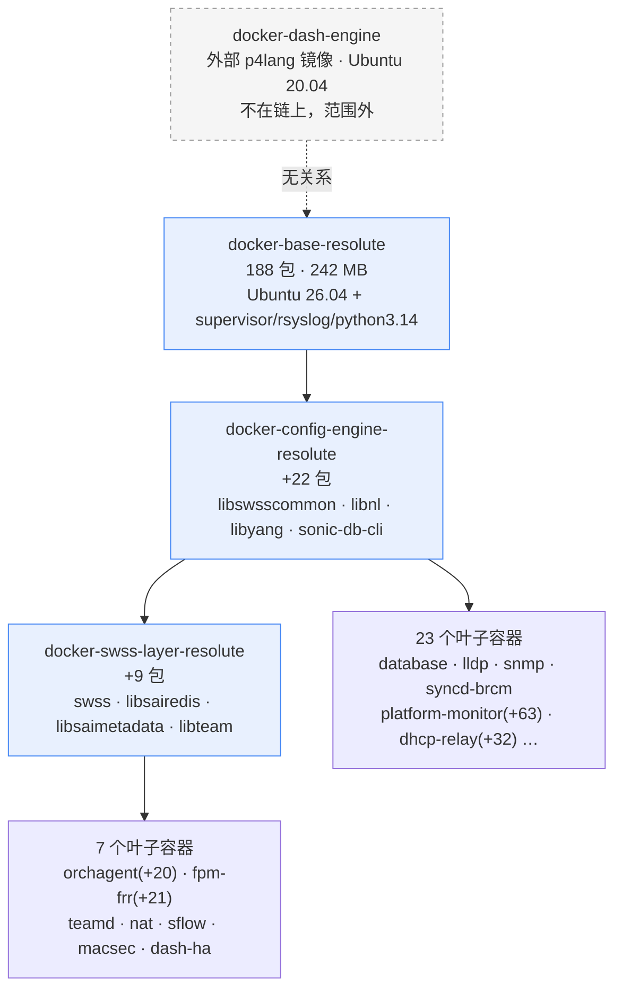
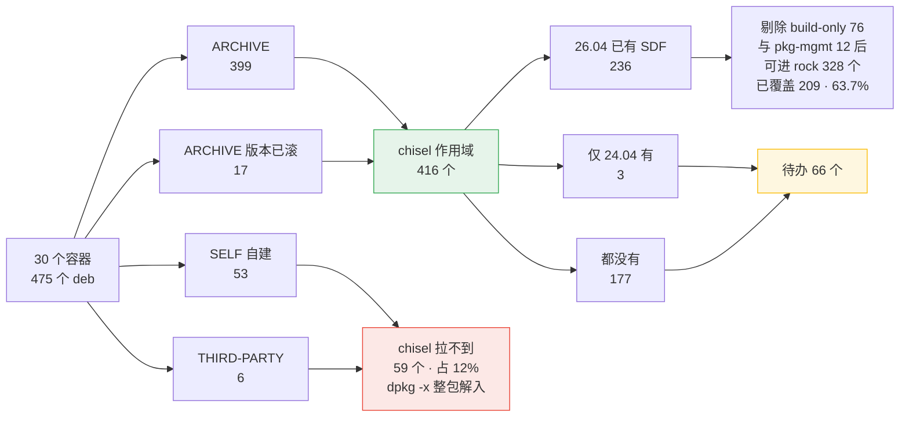
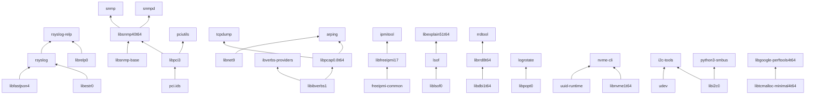

# resolute SONiC 的 chisel 切片工作蓝图

**日期**：2026-09-21
**范围**：**把 SONiC 容器用到的 Ubuntu 归档包切成 chisel slice**，产出送进上游 `canonical/chisel-releases` 的 `ubuntu-26.04` 分支
**不含**：在 rock 里怎么用这些 slice。那是第二部分，见第 7 节的待办摘要
**性质**：工作蓝图，用于分工、排期和验收。证据与测量口径在附录，正文只讲要做什么
**有效期**：包清单与覆盖率采于 2026-09-17；下游 rock 分支事实截至 `3e81d8aa2f`（2026-09-18）

---

## 结论速览

| 问题 | 答案 |
|---|---|
| 要切多少个包？ | 容器用到的 475 个 deb 里 **416 个**在 Ubuntu resolute 归档，是 chisel 的作用域。另有 53 个自建、6 个第三方二进制，chisel 拉不到 |
| 上游已经切好多少？ | 可能进 rock 的 328 个包里**已覆盖 209 个，63.7%**。base 层最重的包已全部到位 |
| 我们要写多少个？ | **65 至 67 项**：补 1 个已有 SDF、从 24.04 移植 3 个、新写 61 至 63 个 |
| 其中最紧的是哪些？ | **10 个**，卡住 4 个已迁移容器；另 54 个是 26 个待迁移容器的**上界估计**，不是承诺 |
| 能立刻开工吗？ | **能。** 本部分不依赖 rock 分支的任何进展，缺的只是本机还没装 `chisel` 和 `spread` |
| 最大的风险？ | 不是上游评审——fork 让交付不被它阻塞。fork 归属已定（jy5275/chisel-releases），但**围绕它的运维约定还没有**（5.7） |
| 要多久 | **两条轨道**（6.1）。rock 交付不等上游合入，写完 SDF 用 fork 消费即可，量级是**周**；上游收敛是 **11 至 32 周**（前 22 个）或 35 至 55 周（全部 66 个），取决于能拿到多少评审注意力 |

---

## 1 · 这份文档的位置

整件事分两部分，仓库、交付物、评审方、时间尺度都不同：

| | **第一部分：切 chisel（本文）** | 第二部分：在 rock 里用 chisel |
|---|---|---|
| 改哪个仓库 | `canonical/chisel-releases`，`ubuntu-26.04` 分支 | `canonical/sonic-buildimage`，`202605_resolute_rock` 分支 |
| 交付物 | SDF（`slices/<包名>.yaml`）+ spread 测试 | rockcraft 配方、pebble 服务、构建集成 |
| 谁评审 | Canonical 上游，周期不由我们控制 | 团队内部，与分支现有作者协作 |
| 需要的技能 | Debian 打包、chisel 格式、上游评审流程 | rockcraft、pebble、SONiC 构建系统 |
| 依赖谁 | **不依赖第二部分**，可立刻开工 | 依赖第一部分产出的 slice |

**为什么这么切**：两者横着混在一起时，「我们改 `stage-packages`、他们管 `services:`」这种边界立不住——换一个 slice 会同时牵动配方的 `organize:`、`prime:` 过滤和整包清单，而那些属于配方作者。竖着切开之后，第一部分变成一条可以独立推进的供给线，第二部分按自己的节奏消费。

**消费者是谁**：`202605_resolute_rock` 分支上已有 4 个容器迁到 rockcraft + pebble，走 `base: bare` 的 chisel distroless 路线。其中 `docker-database` 是唯一真正切过的，它的配方里有一个 part 直接叫 `install-unchiselled-packages`——**那就是本文待办的实证来源**，作者每遇到一个没有 slice 的包就往里加一行。第二部分的细节见第 7 节。

---

## 2 · 三张图

### 2.1 容器继承链：为什么共享层的包要乘以 30



蓝色三层不单独运行，但其中每个包被下游容器原样继承。**base 与 config-engine 的包出现在全部 30 个容器里**——共享层缺一个 SDF，就是 30 个 rock 同时缺。

### 2.2 包的四类来源：chisel 只管得了其中两类



右下角橙色的 **66 个就是任务一的全部工作量**。红色 59 个是 chisel 的硬边界，谁来处理尚无定论（见 6.1）。

### 2.3 待办内部的依赖：22 条边决定合入顺序

chisel 解析 SDF 的 `essential:`，所以**被依赖方必须先合入**，否则依赖方无法针对目标分支验证。



箭头指向「依赖它的包」，所以**箭尾先合入**。这张图推翻了单纯按优先级分数排的顺序：`rsyslog` 分数第 2 但要等 `libestr0` 和 `libfastjson4`，实际排到第 18 位。完整拓扑序见 5.4。

---

## 3 · 作用域与口径

### 3.1 哪些包归 chisel 管

30 个走 SONiC base 链的容器里，dpkg 记录的包分四类来源（明细口径见 7.1）：

| 来源 | 数量 | 归不归我们 |
|---|--:|---|
| ARCHIVE（名字和版本都在 resolute 归档） | 399 | **归** |
| ARCHIVE（版本已被 `-updates` 滚过） | 17 | **归**，SDF 照样适用 |
| SELF（本仓库源构建） | 53 | 不归，chisel 归档里没有 |
| THIRD-PARTY（下载的二进制 deb） | 6 | 不归，同上 |

**作用域 = 前两类 416 个包。**

**但排除不彻底**：自建包依赖归档里的 libhiredis、libzmq5、libboost、libnl3，wheel 依赖 libpython3.14 和 python3-cffi-backend——这些正是出现在待办里的包。**被排除的集合决定了需要哪些 slice**，所以它们的版本漂移在不在范围内不由本文说了算。

**架构边界：全部证据都是 amd64。** 归档索引取 `binary-amd64`，`ld.so` 结论基于 `/usr/lib/x86_64-linux-gnu`。上游 SDF 的 CI 跨 6 个架构验证，**送上游前必须按其他架构复核包内容与路径**，否则只在 amd64 验过的 SDF 可能过不了评审。

### 3.2 待办从哪来

两种口径，混用但要分清：

- **4 个已迁移容器**：读配方的 `install-unchiselled-packages`。包在 26.04 上已有 SDF 就不用管（那是第二部分的换 slice 工作），没有就进待办。这是 3.3 的来源，**实测**。
- **26 个待迁移容器**：只能用 Docker 镜像的包清单推。这个估计**系统性偏大**，因为迁移时会掉 build-only、pkg-mgmt 和整条 supervisord python 依赖链。得出的是**上界**，用于排期不是承诺。这是 3.4 的来源。

`syncd-vs` / `gbsyncd-vs` 是例外：它们比父层多 128 个包、750 MB，源头是一条 `apt-get install` 混装了构建与运行依赖。不为那些连带包写 SDF，等配方作者从零列 `stage-packages` 时自然解决。

### 3.3 待办必须做依赖闭包

`install-unchiselled-packages` 只列配方作者显式写下的包，不列传递依赖——整包安装时 apt 自己解析掉了。但我们要为其中某个包写 SDF 时，**chisel 解析的是 SDF 的 `essential:`，那就必须有被依赖包的 SDF**。

`librelp0` 就是这么漏掉的：`rsyslog-relp` 硬依赖它（`Depends: librelp0 (>= 1.5.0)`），而它没有 SDF，却因为不在配方清单上而整个掉出了待办。同样补回的还有 `libpopt0`（`logrotate` 的硬依赖）和 `libprotobuf32t64`。

闭包脚本跑过一次（63 个种子展开到 215 个包，见 7.4），但清单本身仍是手工维护的表格，**所以 3.3 和 3.4 的数字应当理解为下界**。开工前应当把闭包计算固化成脚本并纳入 CI，让待办从依赖图生成，否则同类遗漏还会发生。

---

## 4 · 任务一：在 fork 里写出 66 个 SDF

**交付物**：66 个 SDF 加 spread 测试，落在我们 chisel-releases fork 的 `ubuntu-26.04` 分支上。
**完成标志**：每个包 `chisel cut` 可安装、chroot 功能测试通过、spread 测试实跑通过。
**瓶颈**：无外部依赖。AI 可并行执行，量级是**周**。
**阻塞谁**：阻塞第二部分的 rock 化。这是 rock 交付的关键路径。

### 4.1 怎么写：用 chisel-slicer skill，不要另起一套

`canonical/mason` 的 `chisel-slicer` skill 定义了完整的十步流程（校验 → 依赖树 → 逐包检查 → 对齐既有 slice → 设计 → 写 SDF → lint → spread 测试 → 对文档核验 → 双 commit），本机装在 `~/.claude/skills/chisel-releases/`。`ubuntu-26.04` 的 `AGENTS.md` 明确要求改 slice 必须用它。

**格式约束、工具用法、slice 命名、测试深度分档、commit 规范一律以 skill 为准**，本文不复述。skill 更新时以它为唯一权威。

**一条值得知道的性质：SDF 里没有版本号。** 694 个 SDF 只有 `package:`、`essential:`、`slices:` 三个顶层字段，没有任何版本约束。版本只存在于两处：`chisel.yaml` 钉住 suite（`resolute` / `-security` / `-updates`）和归档，而包名里的数字（`libpython3.14`、`libboost-serialization1.83.0`、`libsnmp40t64`）是 soname 不是约束。

这有两个后果。好的一面：SDF 不会因为包发了 SRU 就失效，只要文件路径没变。坏的一面：**路径变了它会静默失效**——`chisel cut` 会报找不到文件，但没有任何版本元数据能提前告诉你。所以 7.2 说的 churn 判据才重要，也所以 fork 里的 SDF 需要跟着上游归档重测。

**环境前置：本机目前没有 `chisel` 和 `spread`，开工前必须装上。** chisel 走 snap，spread 需要 lxd 或 docker backend。**两个都要，不能只装 chisel**——skill 要求 spread 测试实跑通过才能提交，只装 chisel 会让这条验收形同虚设。

### 4.2 skill 之外、只属于我们的四条

**一、所有查询必须钉在 resolute 上。** `_deb-list.py` 从 `chisel.yaml` 读 suite，但 `apt-cache depends` 用的是本机 apt 源。本机若是别的 Ubuntu 版本，依赖树和文件清单都会取错，而 `check-slice.py` 查不出这类错误，只有上游 CI 会。**3.2 节那三个从 24.04 移植的包最容易踩**：拿 24.04 的 deb 内容写出来的路径，在 resolute 里可能根本不存在。

**二、依赖闭包已经算好，直接用。** 见 4.6，66 个就是完整集合，内部 22 条依赖边已列出。不需要每个包再重跑一遍 `apt-cache depends --recurse`。

**三、`logrotate` 和 `cron-daemon-common` 的顺序。** skill 的常见退回理由之一是「为没被切片的工具提供配置文件是死重」。这两个包都在待办里，写 `logrotate` 的 SDF 时不要带上它给别的工具的 drop-in。

**四、`util-linux` 是补 slice，不是新写。** 既有 slice 是 append-only，所以给它加一个 `logger` slice 是对的做法，不要去改它现有的任何一片。

### 4.3 待办清单

### 4.4 A 桶：给已有 SDF 补 slice（1 项）

| 包 | 要补什么 | 依据 |
|---|---|---|
| `util-linux` | 加 `logger` slice，收 `/usr/bin/logger` | 43 个容器侧脚本调用；现有 SDF 未含（7.1 节） |

改动量最小、上游最容易接受，**建议作为第一个提交，用来打通 CLA、CI 和评审流程**。

`mawk` 缺 `/usr/bin/awk` 也属同类，但配方统一用 `gawk_bins` 即可绕开，不必等上游，故不列为待办。待写的 `ndisc6` 缺 `/usr/bin/traceroute6`，写的时候带上即可。

### 4.5 B 桶：从 24.04 移植（3 项）

| 包 | 24.04 SDF 行数 | 依据 |
|---|--:|---|
| `rsyslog` | 49 | 每个容器都起 `rsyslogd -n -iNONE`，4 个配方全部整包装了它 |
| `libestr0` | 15 | rsyslog 依赖 |
| `libfastjson4` | 15 | rsyslog 依赖 |

移植是**适配不是复制**：要核 usrmerge 路径、`t64` 改名、`essential:` 必须从列表改成 map（26.04 是 v3，列表形态直接解析报错）、以及 `.deb` 内容本身的增删。

### 4.6 C 桶：已迁移容器实测缺的 SDF（10 项，去掉 B 桶重叠后 9 项，再去掉两个存疑项后 7 项）

这是 4 个配方的 `install-unchiselled-packages` 去重后，真正没有 SDF 的：

| 包 | 出现在 | 备注 |
|---|---|---|
| `rsyslog`、`rsyslog-relp` | 全部 4 个 | rsyslog 见 B 桶；`rsyslog-relp` 必需，配置里真有 `module(load="omrelp")` |
| `librelp0` | 不在配方清单上 | `rsyslog-relp` 的硬依赖（`Depends: librelp0 (>= 1.5.0)`）。配方整包安装时 apt 自动解析所以没出现在清单里，但我们要为 rsyslog-relp 写 SDF，它的 `essential:` 就需要 `librelp0` 的 SDF |
| `libpython3.14` | database、router-advertiser | C 扩展链接它 |
| `python3-yaml`、`python3-redis`、`python3-cffi-backend` | eventd、router-advertiser、mgmt-framework | deb 装的 python 依赖 |
| `net-tools` | eventd、router-advertiser、mgmt-framework | **存疑**：Docker 侧零运行期调用者，疑似从 noble 抄清单带来。开工前找配方作者确认 |
| `libdaemon0` | eventd、router-advertiser、mgmt-framework | **存疑**：同上 |
| `radvd` | router-advertiser | 必需 |

**这 10 个是当前最紧的一批**，因为它们卡住的是已经在做的容器。其中 `net-tools` 和 `libdaemon0` 要先确认是否真需要，可能直接从清单里去掉。

**方法论提醒（本条自身尚未完全落实，见下）**：`install-unchiselled-packages` 只列配方作者显式写下的包，不列传递依赖——整包安装时 apt 自己解析掉了。但我们要为其中某个包写 SDF 时，chisel 解析的是 SDF 的 `essential:`，那就必须有被依赖包的 SDF。`librelp0` 就是这么漏掉的。**待办清单必须做依赖闭包，不能手工维护**。按这个口径复查一遍，另外补回了 2.4 的 `libpopt0` 与 `libprotobuf32t64`。`python3-async-timeout` 是 `python3-redis` 的可选依赖（`python3-async-timeout | python3-supported-min`），python3.14 下后者应已满足，暂不列入但写 SDF 时要确认。

清单目前是手工维护的表格，不是由工具生成的，**因此 2.3 和 2.4 的数字应当理解为下界**。 开工前应当把闭包计算固化成脚本并纳入 CI，让待办清单从依赖图生成——否则同类遗漏还会发生。

### 4.7 上界估计：26 个待迁移容器（约 54 项）

按 Docker 镜像包清单推算，去掉 build-only 与 pkg-mgmt 之后，26 个待迁移容器可能还需要约 54 个 SDF（`radvd` 已归入 3.3，因为 router-advertiser 已迁移）。按受益容器数排序的主要项：

| 层级 | 包 |
|---|---|
| 多容器共用 | `libpci3`、`pci.ids`、`libibverbs1`、`libpcap0.8t64`、`libprotobuf32t64`（swss-layer，14 个容器）、`libprotobuf-lite32t64`、`ibverbs-providers`、`libsnmp-base`、`libsnmp40t64`、`python3-protobuf`、`tcpdump` |
| 两容器共用 | `bridge-utils`、`conntrack`、`dmidecode`、`ethtool`、`freeipmi-common`、`ipmitool`、`libfreeipmi17`、`lsof`、`liblsof0`、`pciutils`、`python3-netifaces` |
| platform-monitor 专属（14） | `udev`、`smartmontools`、`nvme-cli`、`libnvme1t64`、`i2c-tools`、`libi2c0`、`rrdtool`、`librrd8t64`、`libdbi1t64`、`psmisc`、`uuid-runtime`、`xxd`、`python3-bottle`、`python3-smbus` |
| orchagent 专属（5） | `arping`、`libnet9`、`ndisc6`、`ndppd`、`ifupdown` |
| fpm-frr 专属（6） | `libgoogle-perftools4t64`、`libtcmalloc-minimal4t64`、`libpcre2-posix3`、`logrotate`、`libpopt0`（logrotate 的硬依赖）、`cron-daemon-common` |
| 其余 | `snmp`、`snmpd`（snmp）；`libexplain51t64`、`libjsoncpp26`（dhcp-relay）；`kmod`、`lz4`（syncd-brcm）；`libdbus-c++-1-0v5`（sysmgr） |

**这是上界，不是承诺。** noble 分支的经验显示，实际写配方时列出的运行依赖比 Docker 镜像装的少。每个容器写完配方后应按 3.2 的已迁移口径重新确认。

复杂度分布：约三分之二是纯库（`libs` + `copyright`，26.04 上 SDF 中位数 17 行）；其余三分之一带配置或数据文件，需要更细的 slice 划分和更实在的 spread 测试——`udev`、`snmpd`、`rrdtool`、`smartmontools`、`ipmitool`、`logrotate`、`radvd`、`tcpdump`、`ifupdown` 属于这一类。

---

---

---


---

## 5 · 任务二：把 SDF 推上游

**交付物**：66 个 SDF 合入 `canonical/chisel-releases` 的 `ubuntu-26.04`（以及其他维护中的 release 分支）。
**完成标志**：配方可以把该包从 `override-build` 改回 `stage-packages`。
**瓶颈**：上游评审吞吐，我们控制不了。量级是**月**。
**阻塞谁**：不阻塞 rock 交付。它决定的是我们要背 fork 多久。

**这两个任务可以完全并行**，而且任务一不必等任务二的任何进展。把它们当成一件事会得出错误的排期。

### 5.1 现状：已提 19 个，零合入

**jy5275 已经向 chisel-releases 提了 20 个 PR，覆盖 15 个包，全部落在本文的待办表内，零偏差。这件事不是待启动的提案，它正在进行。**

| PR | 分支 | 包 | 开了多久 | 状态 |
|---|---|---|--:|---|
| #1104 | 26.04 | rsyslog + rsyslog-relp（12 文件） | 53 天 | open，5 条评审 |
| #1109 | 26.04 | rsyslog-relp 及依赖 | — | 已关闭，与 #1104 重复 |
| #1112 至 #1115 | 26.04 | libdaemon0、net-tools、python3-yaml、python3-redis | 51 天 | 全部 open |
| #1116 至 #1119 | **26.10** | 同上四个 | 51 天 | 全部 open |
| #1139 / #1140 | 26.04 / 26.10 | libpython3.14 | 40 天 | open |
| #1163 至 #1171 | 26.04 | bridge-utils、pciutils、smartmontools、tcpdump、arping、ipmitool、radvd、python3-protobuf、python3-smbus | 20 天 | 全部 open |

**19 个 open，1 个关闭，零合入。** 最早的已经等了 53 天。

这改变了几件事：

1. **4.3 的区间不再是推算，而是下限。** 我们已经在队列里 51 天而一个都没进去，说明「独占产能 11 周」那一行是空想。真实节奏更接近甚至差于 FIFO 那一行。
2. **jy5275 已经在同步推 26.10。** 这印证了 4.4 提到的跨 release 转发规则确实适用——PR 数要乘以维护中的分支数，不是一个包一个 PR。
3. **待办表得到独立验证。** 这 15 个包与3.3 的清单完全吻合，没有一个在表外，说明 2.2 的口径是对的。
4. **重复提交已经发生过一次。** #1109 因与 #1104 撞车被关闭。51 个还没提的包在开工前必须先查上游有没有人在做——例如 `udev` 已有 PR #378 挂着。

**所以轨道 B 的当务之急不是多提 PR，而是把已经提的 19 个推动合入。** 在积压清空之前继续投放只会加长队列。

### 5.2 实测的上游节奏

2026-09-21 用 GitHub API 取了 chisel-releases 最近 100 个已合入 PR 和当前全部 open PR：

| 指标 | 实测值 |
|---|---|
| 合入延迟 | 中位 **3.7 天**，P75 16.4 天，P90 26.4 天，最长 64 天 |
| 合入速率 | 全分支 6.1 PR/周；**`ubuntu-26.04` 只有 1.9 PR/周** |
| 当前积压 | open PR 100+，中位年龄 **46 天**，61 个超过 30 天，最老 600 天 |
| 其中 26.04 | **39 个 open**，89% 标着 `REVIEW_REQUIRED` |
| PR 形态 | 改动文件中位 **2 个**（SDF + spread 测试），100 个里只有 2 个标题含并列 |
| 贡献者集中度 | top1 一人占 48/100 |

**PR 基本不打包多个包。** 文件数大的 PR（61 文件的 `gcc`、23 文件的 `binutils`）是单包跨多架构。所以「一个包一个 PR」是上游的既成形态，不是我们的选择。

**这几个数的解读要谨慎，它们比看上去弱：**

- `REVIEW_REQUIRED` 只表示「还没有批准」，不等于「作者已经没事可做」——CI 挂着、被要求改动、草稿状态都可能是这个值。用它论证「瓶颈在评审侧」是**偏强**的推断。
- 合入延迟只统计**已合入**的 PR，天然漏掉了那些卡死不动的，是幸存者偏差。真实的「提交到落地」分布比 3.7 天难看。
- 1.9 PR/周是**历史流出速率**，受贡献者数量限制，不等于评审产能上限。我们多推 PR 未必按这个速率线性排队。

要把这些坐实，需要测「ready-for-review 到首次评审」「作者响应时间」「批准到合入」以及被关闭未合入的那部分。**这些数据尚未采集。**

### 5.3 要多久：一个区间，不是一个数

用合入速率倒算时有两个容易犯的假设：我们独占全部产能，且前面没有队列。两条都不成立，所以结果是区间而非单值：

| 算法 | 结果 | 成立条件 |
|---|--:|---|
| 22 ÷ 1.9 | 11 周 | 我们独占 26.04 全部产能、且插队到 39 个积压之前 |
| (39 + 22) ÷ 1.9 | **32 周** | 严格 FIFO，我们排在现有积压之后 |
| 22 ÷ (1.9 ÷ 2) | 23 周 | 我们拿到一半产能 |

**真实值落在 11 到 32 周之间，取决于一件我们控制不了的事：能拿到多少评审注意力。** GitHub 评审不是 FIFO，所以 32 周也不是硬上限，但把 11 周当预期是不诚实的。**这个区间应当写进任何对外承诺，而不是取下限。**

全部 66 个按同样算法是 35 到 55 周。

### 5.4 推送顺序

既然 66 个最终都要推，问题就是顺序。按三个判据打分：

- **fork 维护代价（权重最高）。** 包被 SRU 更新时，fork 里的 SDF 要跟着改并重测。实测 66 个里只有 **9 个**在 `resolute-updates` 或 `resolute-security` 里出现过。**这 9 个留在 fork 里最贵，应当最先推走。**
- **被上游抢先的概率。** 归档反向依赖数（`rdep`）越高，上游自己切它的可能性越大。一旦上游收了同名但切分不同的 SDF，我们的 fork 版本就冲突了。
- **将来迁移成本。** 容器数决定 slice 转上游那天要改多少处引用。它只影响一次性成本，所以权重最低。

按这三项打分后的前 22 个：

| 优先级 | 包 | churn | rdep | 容器 | 推它的主要理由 |
|--:|---|---|--:|--:|---|
| 1 | `libpython3.14` | security | 279 | 30 | 三项全高 |
| 2 | `rsyslog` | security | 49 | 30 | 有安全更新且每容器都用 |
| 3 | `rsyslog-relp` | security | 0 | 30 | 同上 |
| 4 | `udev` | security | 85 | 1 | 有安全更新，且上游大概率自己会切 |
| 5 | `freeipmi-common` | security | 39 | 2 | 有安全更新 |
| 6 | `libfreeipmi17` | security | 24 | 2 | 有安全更新 |
| 7 | `uuid-runtime` | security | 16 | 1 | 有安全更新 |
| 8 | `xxd` | security | 3 | 1 | 有安全更新 |
| 9 | `python3-yaml` | — | 404 | 30 | 抢先风险最高之一 |
| 10 | `dmidecode` | updates | 14 | 2 | 有更新 |
| 11 | `kmod` | — | **1279** | 1 | 抢先风险最高 |
| 12 | `libpopt0` | — | 124 | 30 | |
| 13 | `libpcap0.8t64` | — | 168 | 4 | |
| 14 | `libpci3` | — | 160 | 5 | |
| 15 | `net-tools` | — | 47 | 30 | 若按 4.3 默认判为不需要则跳过 |
| 16 | `libprotobuf32t64` | — | 95 | 14 | |
| 17 | `python3-redis` | — | 26 | 30 | |
| 18 至 22 | `libdaemon0`、`libfastjson4`、`libestr0`、`python3-cffi-backend`、`librelp0` | — | 低 | 30 | 容器数高，将来迁移成本大 |

**注意 churn 判据会推翻直觉排序**：`freeipmi-common`、`libfreeipmi17`、`dmidecode`、`uuid-runtime`、`xxd` 看起来都是边缘包（单或双容器、低 `rdep`），但它们有安全更新，留在 fork 里最贵，所以排在前面；而 `libibverbs1`、`libjsoncpp26`、`psmisc`、`logrotate` 的 `rdep` 不低，却因为零 churn 可以慢慢来。**按容器数或 `rdep` 单独排都会排错。**

还有两点：

- **`util-linux` 不在这张表里**，因为它是给已有 SDF 补一个 slice（3.1），不是新写。它仍然应当第一个提交，用最小改动趟通流程。所以前 22 个加上它是 **23 个 PR**；若按 4.3 默认去掉 `net-tools` 和 `libdaemon0`，是 **21 个**。
#### 依赖闭包已完成

对 66 个待办包做了完整的 `Depends` 闭包（只取第一候选，忽略 `Recommends`/`Suggests`），结果：

- **闭包只多出 3 个包**，且全部不需要 SDF：`adduser` 和 `debconf` 只被 maintainer 脚本用到（chisel 不跑它们，skill 明确说可以丢依赖），`python3-async-timeout` 是 `python3-async-timeout | python3-supported-min` 的第一候选而 python3.14 满足后者。**所以 66 个就是完整集合。**
- **待办内部有 22 条依赖边**，必须按叶子优先合入：

```
rsyslog        ← libestr0, libfastjson4        rsyslog-relp ← librelp0, rsyslog
libpci3        ← pci.ids                        libsnmp40t64 ← libpci3, libsnmp-base
snmp / snmpd   ← libsnmp-base, libsnmp40t64     pciutils     ← libpci3
libpcap0.8t64  ← libibverbs1                    tcpdump      ← libpcap0.8t64
arping         ← libnet9, libpcap0.8t64         ibverbs-providers ← libibverbs1
libfreeipmi17  ← freeipmi-common                ipmitool     ← libfreeipmi17
lsof           ← liblsof0                       libexplain51t64 ← lsof
librrd8t64     ← libdbi1t64                     rrdtool      ← librrd8t64
logrotate      ← libpopt0                       nvme-cli     ← libnvme1t64, uuid-runtime
i2c-tools      ← libi2c0, udev                  python3-smbus ← libi2c0
libgoogle-perftools4t64 ← libtcmalloc-minimal4t64
```

拓扑排序后（同层按 5.4 的分数降序）前十位是：`libpython3.14`、`udev`、`freeipmi-common`、`libfreeipmi17`、`uuid-runtime`、`xxd`、`python3-yaml`、`dmidecode`、`kmod`、`libpopt0`。

**排序结果推翻了上面那张按分数排的表：`rsyslog` 从第 2 位掉到第 18 位**，因为它必须等 `libestr0` 和 `libfastjson4` 先合入；`rsyslog-relp` 掉到第 20 位。另有 9 个低分包（`libpopt0`、`net-tools`、`libprotobuf32t64`、`python3-redis` 等）被依赖关系提前。**实际提交顺序以拓扑序为准，分数只决定同层内部的先后。**

### 5.5 提交队列

轨道 B 的调度是**维持恒定在途 PR 数**，不是分批投放：

- **在途上限 5 至 8 个。** 多了只会在队列里变老，还会稀释评审者对我们的注意力。
- **顺序按 5.4 的优先级，但要先过依赖图。** 注意：同批不等于依赖已解决——`librelp0` 必须**先合入**，`rsyslog-relp` 才能针对目标分支验证。
- **合入一个补一个。**

第 3 节的待办清单是**编写队列**（轨道 A，全部 66 个，不分先后，AI 可并行），与这里的**上游队列**（轨道 B，按 5.4 排序）是两张表。不要混用。

### 5.6 合入前配方怎么消费

上游评审没有承诺周期。若把「PR 合入」当唯一门槛，我们和下游都会空等——配方引用一个尚不存在于 release 仓库的 slice 名字会直接构建失败。

rockcraft **没有**一个指向自定义 chisel release 的配置字段——`stage-packages` 只认上游 release。官方记录的做法（rockcraft 文档 how-to/chiselling/install-slice）是绕过 `stage-packages`：

1. 用一个 part 把本地 `chisel-releases` 目录送进构建器（build-context）。
2. 在 `override-build` 里手工跑 `chisel cut --release ./chisel-releases --root ... <pkg>_<slice>`。

**这意味着中间态和终态的配方结构不同**：合入前该 slice 走 `override-build`，合入后才能挪回 `stage-packages`。每个包要改两次配方。

**中间态比这条命令看起来复杂。** `chisel cut` 解析 `essential:` 是对整个 release 做的，所以那条命令会把该 slice 的**全部传递依赖**一并解进同一个 `--root`。如果这些依赖里有些已经通过 `stage-packages` 装过，就会出现同一批文件被装两遍。这个冲突怎么避免，本文没有答案，**因为这条路径一次都还没走过**——它现在是草图不是流程。批 0 必须真正跑通一次并把结果写下来，否则后面每个 fork-only 包都会重新撞一次。

两个必须知道的后果：**fork 必须是 `ubuntu-26.04` 的完整副本并持续 rebase**，否则其他 slice 的解析会跟着漂；**slice 名在评审中可能被要求改名**，届时按 fork 名字写的 `override-build` 会断，所以中间态的引用要集中、可一次性替换。

**这条路径是批 0 的一部分，不是背景说明**：要在批 0 里真正打通一次（拿 `util-linux_logger` 走一遍 override-build 引用），并把步骤写进 `AGENTS.md`，否则整条供给线被上游节奏锁死。

---
### 5.7 fork 的代价，也就是任务二存在的理由

**fork 的成本不止 `override-build` 模板那一次性投入**，完整清单是：

| 项 | 说明 |
|---|---|
| 跟踪上游变更 | fork 里的 SDF 在 `essential:` 引用上游 slice 名，上游改名或改切分就要跟 |
| 安全更新 | 包发 SRU 时 SDF 可能要改路径，且要重测。这是 5.4 判据一的来源 |
| 跨架构 | 上游 CI 跨 6 架构，我们的 fork 里没有这套 |
| rebase | fork 必须是 `ubuntu-26.04` 的完整副本并持续跟进 |
| 冲突处理 | 上游哪天收了同名 SDF 时的合并 |
| 最终迁移 | 每个转上游的 slice 都要把配方从 `override-build` 改回 `stage-packages` |

**fork 是一个需要有人负责的内部产品**：要有 owner、钉住的 revision、CI 矩阵、更新 SLA、升级到上游的规则、冲突处理流程。

**归属已定**：用 [github.com/jy5275/chisel-releases](https://github.com/jy5275/chisel-releases)，它是 `canonical/chisel-releases` 的 fork，当前仍在活跃推送，已有 `dev/docker-database` 这类整合分支。上面那份清单是它需要配套的运维约定，不是重新找一个 fork。

「57 个包五个月没发 SRU」不等于「一个 release 周期内也不会发」。这个数据只覆盖了 resolute 发布至今，不能外推到整个生命周期。

## 6 · 风险与工作量

### 6.1 风险

| 项 | 性质 | 应对 |
|---|---|---|
| 上游评审吞吐 | 轨道 B 的进度约束，**不阻塞 rock 交付**（6.1） | 26.04 每周 1.9 个 PR、积压 39 个。按 5.4 的优先级先推 fork 维护代价最高的，其余慢慢来。对外承诺用 11 至 32 周的区间，不要取下限 |
| 长期 fork 的运维约定 | 已有归属，缺配套（5.7） | fork 用 `jy5275/chisel-releases`，归属不再是问题。但它仍需要钉住的 revision、CI 矩阵、更新 SLA 和冲突处理规则——任务一交付后它就是生产依赖 |
| 待办清单仍是手工维护的 | **正确性风险** | 已知漏过 `librelp0`。把闭包计算固化成脚本纳入 CI（3.3） |
| 上界估计偏大 | 开放项，非风险 | 3.4 的 54 个是按 Docker 镜像推的，下游配方写完后按 3.2 口径重新确认 |
| 带配置的包被打回返工 | 范围风险 | 约 18 个「带配置」SDF 需要实质性 spread 测试。skill 明确要求数据类包必须**连同消费者一起装并证明消费者用到了数据**，只查文件存在算弱测试。提交顺序上放在后面 |
| 只在 amd64 验证 | **正确性风险** | 上游 CI 跨 6 架构，送审前按其他架构复核（3.1） |
| 59 个包 chisel 根本管不了 | 不在本 roadmap item 内 | 53 个自建 + 6 个第三方，占 475 的 12%。走 PPA 还是 superdistro 由别的 item 追踪，本文不处理 |
| 单个 PR 无限期悬挂 | **已在上游发生**，不是假设 | 实测最老的 open PR 已 600 天，61 个超过 30 天。止损规则：**超过 P90（26 天）无反馈即升级**到 Canonical 内部渠道；若该包不在关键路径上，直接转入长期 fork 而不是继续等。现在没有负责人 |
| 镜像基线新旧混合 | 数据风险 | vs 专属的 3 个镜像产于 2026-08-27，其余 09-17，base 层 09-03。**在开始处理第 3 档（fork）之前重跑一次扫描**，因为那批的归属判断最依赖容器分布数据 |

### 6.2 工作量

**编写不是约束项。** chisel-slicer skill 的 10 步工作流（校验 → 依赖树 → 逐包检查 → 对齐既有 slice → 设计 → 写 SDF → lint → spread 测试 → 对文档核验 → 双 commit）**整套可以由 AI 自主执行**，止于 commit，PR 由人开。所以「多少人日」这个问题问错了方向。

留一个数量级参考：单个包从 `_deb-list.py --sdf` 生成草稿到两个 commit 落地，AI 跑一遍是分钟级；带配置的复杂包（`udev`、`snmpd`、`rrdtool`）主要耗在 spread 测试设计上，仍是小时级而非人日级。**66 个包的编写总量以天计，不以周计。**

**真正的排期数见 5.3，而且是个区间：前 22 个 11 至 32 周。** 但那是轨道 B；rock 交付走轨道 A，不等它。与编写工时差两个数量级，所以讨论人力前先确认走哪条轨道。

需要人的地方只有三处，且都不在编写上：

| 事项 | 为什么必须是人 |
|---|---|
| 开 PR 与应对评审意见 | skill 明确止于 commit，「the user opens the PR themselves」 |
| 与上游谈评审安排 | 这是关系不是工程。4.1 显示 19 个 PR 零合入，这件事比再提新 PR 有用 |
| 给 fork 定运维约定（5.7） | 需要产品判断：钉住的 revision、CI 矩阵、更新 SLA 各投多少 |

---

## 7 · 附录

### 7.1 证据与口径

正文的数字来自三次测量。这里只放口径和结论，明细在 7.2 的数据文件里。

**容器里的 deb 分四类来源**（30 个走 SONiC base 链的容器，对照 74,340 个包的归档索引和 192 个自建 deb）：

| 来源 | 数量 | 含义 |
|---|--:|---|
| ARCHIVE | 399 | 名字和版本都在归档，有 SDF 就能切 |
| ARCHIVE（版本不同） | 17 | 装的版本已被 `-updates` 滚过，SDF 照样适用 |
| SELF | 53 | 本仓库源构建，chisel 拉不到 |
| THIRD-PARTY | 6 | `otelcol-contrib`（325 MB）、`saicredo-*` 四个、`sonic-build-hooks` |

**SDF 覆盖率**（对照 `ubuntu-26.04` @70d32b4 的 694 个 SDF，以及 25.10 / 24.04）：

| 类别 | 26.04 已有 | 仅 24.04 有 | 都没有 | 小计 |
|---|--:|--:|--:|--:|
| runtime | 205 | 3 | 114 | 322 |
| perl | 4 | 0 | 2 | 6 |
| pkg-mgmt | 9 | 0 | 3 | 12 |
| build-only | 18 | 0 | 58 | 76 |
| **合计** | **236** | **3** | **177** | **416** |

**口径警告**：416 里有 76 个 build-only 和 12 个 pkg-mgmt，剔掉后**可能进 rock 的 328 个、已覆盖 209 个，63.7%**。正文用的是剔除后的口径。

这组数字已复核修正。`chiselcov2.py` 原先按包名前缀判断，把 `gcc-16-base`、`libgcc-s1`、`rpcsvc-proto`、`libapt-pkg7.0` 四个误判成 build-only 或 pkg-mgmt——前两个出现在 30 个容器里，是每个 C/C++ 二进制都要的运行期支持库。改判依据不是 Section（`libasan8`、`libclang1-21` 的 Section 也写着 `libs`，但它们确属编译期），而是**容器分布**：只出现在 `syncd-vs` / `gbsyncd-vs` 的是工具链泄漏，出现在多个容器的是真运行期。修正后覆盖率从 63.6% 变到 63.7%，几乎不动，但分母和分类计数要用新的。另外 **25.10 对我们零增量**，移植来源只剩 24.04 的 3 个包。

**已有 slice 拼不回整包，但缺的都不是运行期要的。** 把 236 个包的真实 `.deb` 与「该包所有 slice 的 `contents:` 并集」逐文件比对：8,575 个文件被覆盖，3,245 个是 man/doc/completion/locale（chisel 的政策性排除），**452 个真缺口**分布在 70 个包里。真缺口中 146 个是 `-dev`、109 个是 `/usr/share/bug` 之类、50 个是 setuptools 的 vendored 模块、34 个是 apt 内部工具。**只有一处与我们有关**：63 个未覆盖二进制里的 `logger`（属 `util-linux`），43 个容器侧脚本调用它，成了 2.1 的待办。

同类的还有 alternatives 符号链接：8 个用 update-alternatives 的包里 6 个已在 SDF 里处理，`mawk` 漏了 `/usr/bin/awk`。但 database 配方用的是 `gawk_bins` 而 gawk 的 SDF 有这个链接，**统一用 gawk 即可绕过**，不必等上游。


### 7.2 maintainer 脚本：为什么大部分不用管

236 个包里 62 个带 `preinst`/`postinst`/`prerm`/`postrm`。chisel 不执行它们，而且是**结构性做不到**——解包时只读 `data.tar.*`，存脚本的 `control.tar.*` 从头到尾没打开过。上游立场写在 `how-to/slice-a-package` 第 1.4b 步：*"Whatever these scripts do, you should aim to reproduce when defining the slices."*

四类副作用，三类有成熟解法：

| 副作用 | 上游做法 | 我们要做什么 |
|---|---|---|
| 派生配置文件 | `mutate:` 用 Starlark 模仿 postinst（26.04 上 9 个 SDF 这么做） | 写新 SDF 时照做 |
| alternatives 符号链接 | 显式 `symlink:` 条目 | 统一用 gawk 即可绕开 |
| ldconfig / `ld.so.cache` | 只提供工具不生成缓存 | **每容器抽查一次**，见下 |
| pycache / binfmt | 完全不管 | 可选优化 |

**`ld.so.cache`**：`ld.so` 的内建回退搜索路径含 `/lib/x86_64-linux-gnu`、`/usr/lib/x86_64-linux-gnu`、`/lib`、`/usr/lib`，而 SONiC 自建库全装在 `/usr/lib/x86_64-linux-gnu`。宿主机上用 `--inhibit-cache` 模拟缺失后 `python3 -c "import ssl"` 照常工作。**但这个测试是在宿主机做的，不是在切出来的 rootfs 里，也没覆盖 53 个自建包和 6 个第三方二进制**，所以按「每容器抽查一次」对待，不要当成已关闭的议题。会踩的情形是库装在非默认目录并依赖 `ld.so.conf.d`。

**pycache**：任何 python deb 都不附带 `.pyc`，本机 624 个全是 postinst 现场生成的。切出来的 rootfs 没有字节码，解释器每次启动重新编译。这是性能问题不是正确性问题，在意就在构建步骤跑 `python3 -m compileall`。

**用户和组是唯一没有上游解法的一类**：694 个 SDF 里只有 `base-passwd` 碰 `/etc/passwd`，给的是静态的 18 用户 39 组。多个 SDF 注释挑明了这点，例如 `redis-tools.yaml`：*"depends on adduser ... however we don't support this currently"*。要求增加 `adduser` slice 的 issue（chisel-releases#549）自 2025-04 起一直开着。具体要建哪 5 个用户见 8.2。


### 7.3 数据文件

位于 `docs/superpowers/data/2026-09-17-container-package-inventory/`，采集于 2026-09-17。

该目录已随本文档一并入库，42 个文件、约 2.5 MB。

| 文件 | 内容 |
|---|---|
| `REPORT.md` | 34 个镜像的分层逐包清单、每层增量、python 分发清单 |
| `CHISEL-COVERAGE.md` | 四类来源判定、三分支覆盖矩阵、逐包待办表、每容器缺口表 |
| `SLICE-COMPLETENESS.md` | 236 个包的 `.deb` 与 slice 并集逐文件比对结果 |
| `slice-completeness.json`、`docker-*.json` | 原始数据 |
| `pkgscan.py`、`pkganalyze.py`、`chiselcov2.py`、`slicecov.py` | 生成脚本 |

注意这批数据是按 **Docker 镜像**采的，对应 2.2 的上界口径。已迁移容器请以 rockcraft 配方为准。


### 7.4 复现方法

1. `pkgscan.py <outdir> target/docker-*.gz` —— 从 OCI 层流式抽取 `var/lib/dpkg/status` 与 python `*.dist-info`，按层序叠加。不加载、不运行镜像。
2. `pkganalyze.py` —— 推断继承链、算每层增量，生成 `REPORT.md`。
3. `chiselcov2.py` —— 比对归档索引与 chisel-releases 三分支，生成 `CHISEL-COVERAGE.md`。需先下载 `resolute{,-security,-updates}` 的 `main`/`universe` amd64 `Packages.xz`。
4. `slicecov.py` —— 下载 236 个真实 `.deb`，逐文件比对 slice 并集。

查某个包在 26.04 上有没有 SDF，最快的办法是在 chisel-releases 的 `ubuntu-26.04` checkout 里 `ls slices/<pkg>.yaml`。


依赖闭包脚本（63 个种子展开到 215 个包，用于发现 `librelp0` 这类只作为依赖出现的缺口）**尚未纳入仓库，是 2.3 提到的待固化项。**

**另外三处复现缺口，一并固化时解决**：`chiselcov2.py` 与 `slicecov.py` 写死了作者的 home 路径和 `/tmp` 中间态；`chiselcov2.py` 依赖一个预先生成的 `resolute-amd64.json`，而上面第 3 步没说它怎么来（是从 `Packages.xz` 解析出的 name→versions 映射）；归档快照没有记录 digest 或日期，所以今天重跑不保证得到同样的数字。**目前这套脚本是「作者机器上可复现」，不是「干净检出即可复现」。**


### 7.5 参考

- Chisel 文档：<https://documentation.ubuntu.com/chisel/en/latest/>
- rockcraft 文档：<https://documentation.ubuntu.com/rockcraft/>，建用户的 how-to 见 `how-to/crafting/add-internal-user-to-a-rock`
- chisel-releases：<https://github.com/canonical/chisel-releases>，PR 规范见 `main` 分支 `CONTRIBUTING.md`，分支约束见 `ubuntu-26.04` 的 `AGENTS.md`
- 工作分支：`canonical/sonic-buildimage` 的 `202605_resolute_rock`；noble 先例见 `202405_rock_pebble`

---

## 8 · 第二部分待办：在 rock 里用 chisel

第二部分不在本文范围内，但下面这些结论已经查清，**应当单独成文**。

**本节数字锚定在 `202605_resolute_rock` 的 `3e81d8aa2f`（2026-09-18）。** 那个分支仍在密集提交，下面的 70 / 44 / 10 三个数字一次 rebase 就可能失效，接手时先重跑一遍。依赖闭包脚本尚未纳入仓库（7.4），重算需要先补上。

### 8.1 立刻能做、不需要上游的优化

已迁移的 4 个配方整包装了 **70 项次**，其中 **44 项次**今天就能直接换成 26.04 上现成的 slice：

| 容器 | 整包项次 | 可换 slice | 真缺 SDF |
|---|--:|--:|--:|
| database（已切过） | 5 | 2 | 3 |
| eventd | 20 | 13 | 7 |
| router-advertiser | 22 | 13 | 9 |
| sonic-mgmt-framework | 23 | 16 | 7 |

三列纵向相加是**项次不是包数**；「真缺 SDF」去重后是 10 个包，不是 26 个。`database` 那 2 项是 `libboost-serialization1.83.0` 和 `libxxhash0`，两者在 26.04 上都有 SDF，装整包属于遗漏。

**但顺序要对：先裁剪、再切片。** 另外 3 个容器的配方是从 noble 分支抄来的大清单，还没按 database 的样子切过，那 44 项次里有相当一部分根本不该出现在配方里。正确动作是先确认每个包是否真有运行期消费者，删掉没有的，剩下的再换 slice，否则会认认真真地为不需要的包做优化。

**验收不能只看服务起来**：整包换 slice 的典型故障是运行期缺文件（某个 `.so`、`/etc` 下的配置、`pci.ids`），进程照样能起。每个容器都要有功能自检——database 跑 `redis-cli ping`，eventd 验证事件写进 DB，router-advertiser 确认发出 RA，mgmt-framework 确认 REST 端点响应。

### 8.2 建用户

rockcraft **没有声明式的建用户能力**。`run-user` 只接受 `_daemon_` 一个值，是 OCI 层面的默认用户，不是建账号的工具。官方做法是在 part 脚本里手工建：`base: bare` 用 `override-build` 里的 `useradd --root ${CRAFT_PART_INSTALL}`，非 bare 用 `overlay-script` 里的 `useradd -R $CRAFT_OVERLAY`，前提是先 stage `base-passwd_data` 和 `base-files_base`。

需要建 5 个：

| 用户 / 组 | 容器 | 依据 |
|---|---|---|
| `Debian-snmp` | snmp | 启动命令显式带 `-u Debian-snmp -g Debian-snmp` |
| `radvd` | router-advertiser | 二进制内建 privsep |
| `frr` + `frrvty` | fpm-frr | `frrcommon.sh` 写死 `FRR_USER="frr"`；Dockerfile 已用 `FRR_USER_UID = 300` 自建，直接翻译即可 |
| `_lldpd` | lldp | 二进制内建 privsep |
| `syslog` | 全部 | 我们的 rsyslog 不降权因而未必需要，但两个 rock 分支都建了，代价极低，建议沿用 |

`adm` 组已在 `base-passwd` 里，rsyslog 的 `$FileGroup adm` 自动满足。确认不需要的：`i2c`、`netdev`、`rdma`、`crontab`、`uuidd`、`_ssh`。

三个陷阱：不 stage `base-passwd_data` 时 `useradd --root` 会**静默成功**并写出一个连 `root` 都没有的 `/etc/passwd`；chroot 里没有 `/etc/login.defs` 时 uid 默认取 999，所以要显式 `-u` 钉死；会留下 `etc/passwd-`、`etc/group-`、`etc/.pwd.lock`，用 `prime:` 过滤。

**`redis` 不在上表里，但那不是好消息。** database 的 init 脚本加了 `USE_PEBBLE` 开关，把 5 处 `chown -R redis:redis` 挪进了 supervisord 分支，pebble 路径下 redis 以 root 跑。**那是放弃了最小权限边界，不是问题解决了。** 两个 rock 分支的 `services:` 块都没用过服务级 `user`/`group` 字段，所以目前所有 pebble 服务都以 root 跑。应当确认 pebble 是否支持服务级用户，若支持就保留服务身份。这条建议交安全评审拍板。

### 8.3 两个已知阻塞

**rockcraft 产物缺 `com.azure.sonic.versions.*` 标签。** 2026-09-18 的提交因此把 `dhcp-relay`、`dhcp-server`、`macsec` 从 `SONIC_PACKAGES_LOCAL` 改成 `SONIC_INSTALL_DOCKER_IMAGES`——database 一旦变成 rock，`sonic-package-manager` 校验其他镜像依赖时就会失败。当前靠让受影响容器绕开包管理器规避，会随 rock 化扩散。

**rock 构建没接进 make。** 根目录一个 `build_rocks.sh`，容器列表硬编码，rock 产物不参与依赖与缓存。容器多了要重新设计。

### 8.4 协作边界

分支上目前**没有写下来的协作约定**——`AGENTS.md` 在 `202605_resolute_rock` 上只改了一句与文档时效性有关的话，没有任何 rock、pebble 或 chisel 相关的段落。同步方向是定期把 `202605_resolute` 合入 rock 分支（最近一次 2026-09-07），不要反向合并。

第二部分成文时应当先与分支现有作者对齐分工并补进 `AGENTS.md`。有一条审阅意见值得一并考虑：与其按「配方 / slice」横向分工，不如**按容器纵向推进**——先用整包跑通一个行为正确的 rock，联合记录确切需求，再只为确认过的包写 SDF。
