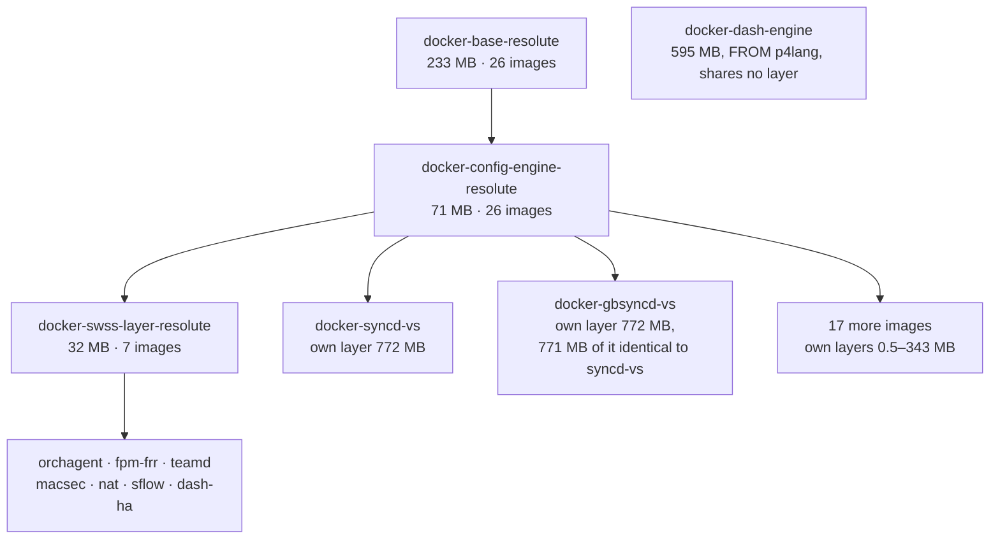
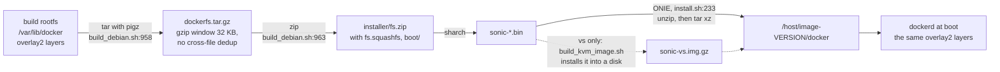
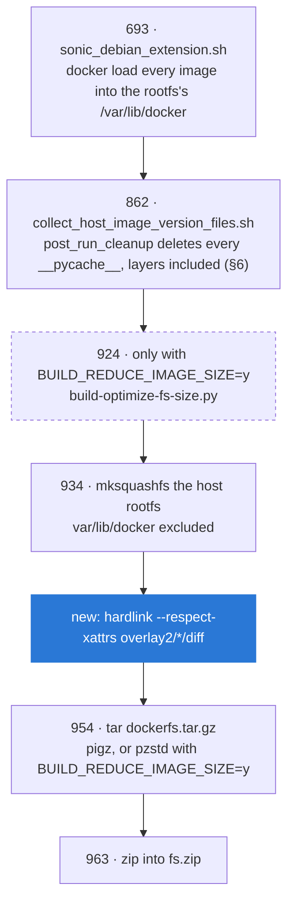
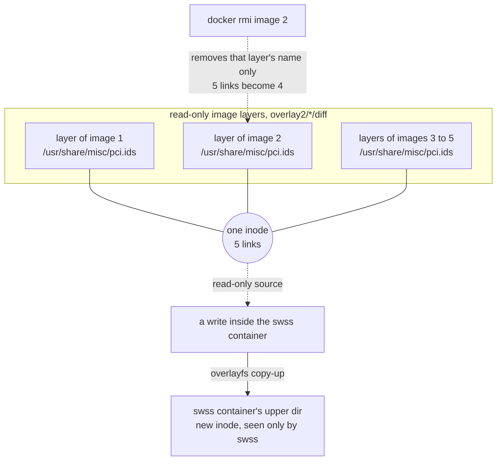
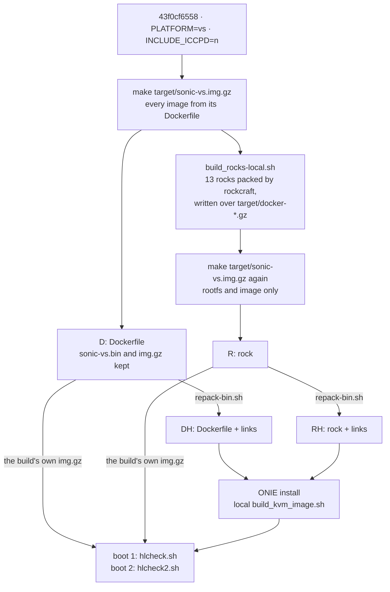
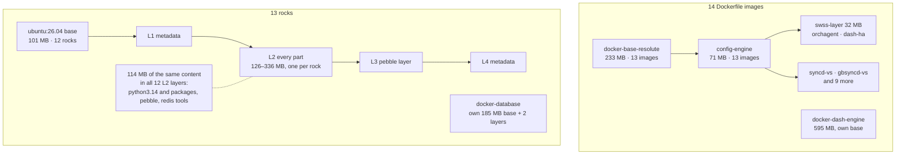
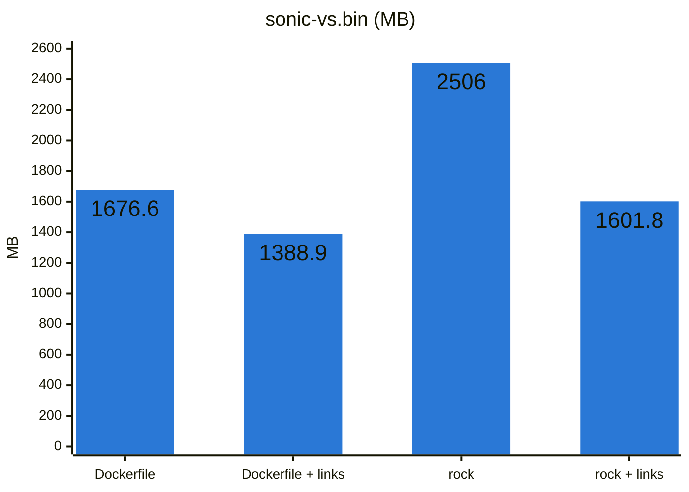
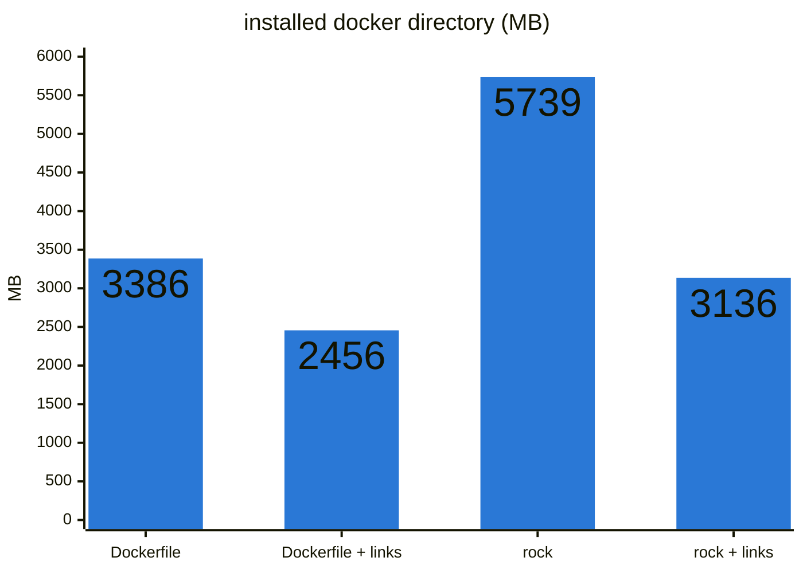
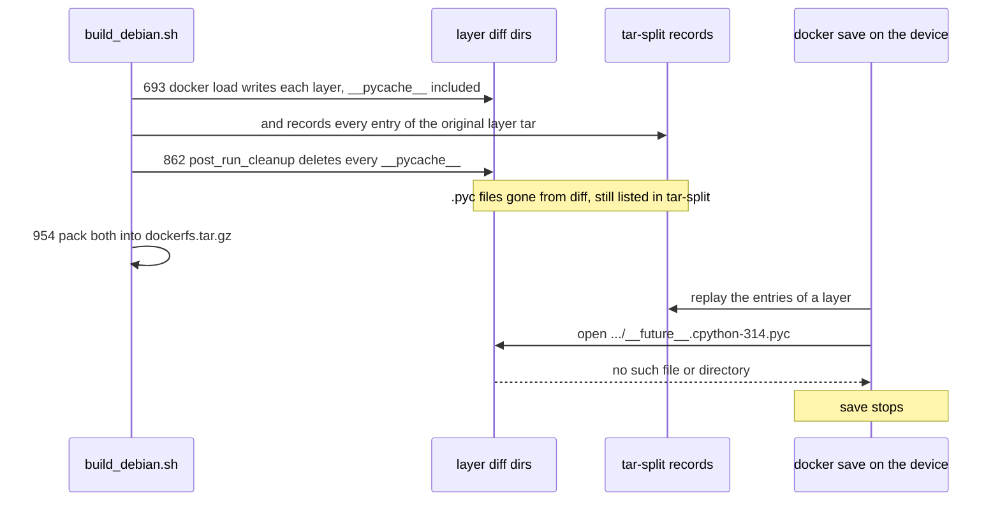
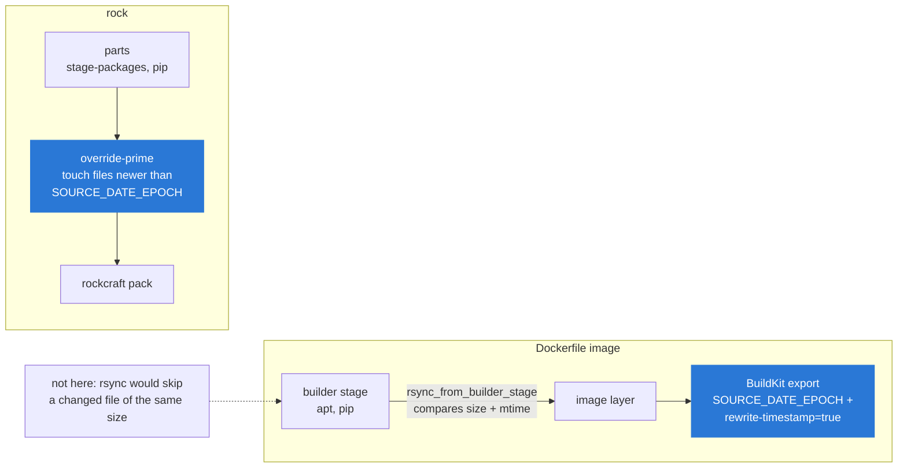

# Duplicate files across SONiC docker images: measurements and the hardlink fix

- Date: 2026-09-29
- Images measured (all amd64):
  - resolute broadcom: the 2026-09-17 incremental build, the PR #14 CI build (`c05f0e016`) and the 2026-08-23 from-zero build (`2957b9e3`)
  - resolute vs: the 2026-08-23 from-zero build (`2957b9e3`) and the 2026-08-27 build
  - official upstream 202605 broadcom: Azure build 20260928.6 (`6aec5bee6`, build id 1232715)
  - **same-commit Dockerfile and rock vs images**, both built locally from `test/rock-merge-resolute` `43f0cf6558`, image version `test_rock-merge-resolute.0-43f0cf65`. That commit merges `canonical/202605_resolute` `d2f9ae8502` into `canonical/202605_resolute_rock` `1d187fd351`.
- Change: local branch `feat/dockerfs-hardlink`, one signed commit `6dc4a02257` on top of `d2f9ae8502`, not pushed
- Tools and raw results: [data/2026-09-29-docker-layer-dedup/](data/2026-09-29-docker-layer-dedup/)
- This is the English version and the source of truth; the Chinese version is `-zh.md`

## 0. Conclusions

- **The SONiC docker images are not flattened to one layer.** Each Dockerfile adds one layer on top of its parent image, and overlay2 stores each shared parent layer once (§1).
- **Duplication comes from sibling images.** Images that do not share a parent each install the same files into their own layer.
  - resolute broadcom: 242 MB duplicated, 12% of all layer content.
  - resolute vs: 969 MB, 29%, most of it syncd-vs and gbsyncd-vs carrying the same toolchain.
  - official upstream broadcom: 241 MB, 11.8%. Upstream has the same problem at the same scale (§2).
  - rock vs: 3126 MB, 55.5% (§5).
- **Where it costs.** gzip cannot deduplicate across files, so the duplicates cost their compressed size in the `.bin` and their full size on disk after install.
- **The fix needs no common parent image.** Running util-linux `hardlink` over `overlay2/*/diff` just before `dockerfs.tar.gz` is packed takes one line in `build_debian.sh` (§3).
  - Upstream already has an opt-in, `BUILD_REDUCE_IMAGE_SIZE` (default `n`), whose script also hardlinks the docker directory. On the same images it saves as much as `hardlink -t`, and on the rock variant more than the default `hardlink` mode (790 against 961 MB). Its metadata changes have no practical effect that we found (§3).
  - It cannot be turned on as-is for ONIE targets. The same option switches `dockerfs.tar.gz` to pzstd, and an image packed that way fails to install from ONIE (§3).
- **Same-commit four-way comparison on vs** (§5): Dockerfile or rock, each with and without links, all from `43f0cf6558` and all installed through ONIE.

  | | Dockerfile | Dockerfile + links | rock | rock + links |
  |---|---|---|---|---|
  | `.bin` | 1676.6 MB | 1388.9 MB | 2506.0 MB | 1601.8 MB |
  | installed docker directory | 3386 MB | 2456 MB | 5739 MB | 3136 MB |

  - Links cut the rock image's overhead over the Dockerfile image from 829 MB to 213 MB in the `.bin`, and from 2353 MB to 680 MB on disk.
  - The linked rock image is smaller than today's unlinked Dockerfile image.
  - All four boot to the same state and pass the same checks.
- **Rock images cannot be `docker save`d on an installed system** (§6). Links have nothing to do with it; the cause predates both.
  - After the images are loaded into the host rootfs, the build's cleanup hook deletes every `__pycache__` directory, including those inside docker layers.
  - A layer whose original tar carried `.pyc` files then no longer matches its tar-split record.
  - This hits all 13 rocks and one Dockerfile image, `docker-gnmi-watchdog`.
- **mtime limits how much can be linked.** By default `hardlink` only merges files whose mtime also matches. On the rock image, clamping build-time mtimes to `SOURCE_DATE_EPOCH` would link a further 462 MB (§7).

## 1. How the images are stored

**Layers.** Images come in two shapes:

- **Dockerfile images.**
  - `docker-base-resolute` ends in `FROM scratch` / `COPY --from=base / /`, which makes it a single layer of 233 MB.
  - Every other Dockerfile starts `FROM $BASE` and adds one layer via the `rsync_from_builder_stage` macro (`dockers/dockerfile-macros.j2:48-50`), plus an empty `rm /cache.tgz` layer.
  - The chain is base (233 MB) → config-engine (94 MB in the 09-17 broadcom build, 71 MB on vs) → swss-layer (32 MB, shared by 7 images) → the image's own layer.
  - A parent layer is stored once no matter how many images sit on it. If every broadcom image were flattened into one self-contained layer, the total would be 9828 MB instead of the 2018 MB stored now.
- **Rock images** have a different shape, described in §5.

The Dockerfile chain in the vs `43f0cf6558` build:



**Storage path.**

- **`.bin`.** `sonic-*.bin` → `installer/fs.zip` → `dockerfs.tar.gz`. That last file is a pigz tar of the build's whole `/var/lib/docker`: overlay2 layer directories plus image metadata (`build_debian.sh:954-963`).
- **Installed disk.** On an installed disk, including the vs `img.gz`, `installer/install.sh:233` untars it into `/host/image-<version>/docker`.
- **Neither form deduplicates across layers.**



## 2. How much is duplicated

"Duplicated" means bytes of a regular file whose content (sha256) already exists elsewhere in the layer set. "Shadowed" means bytes in a lower layer that an upper layer of the same image overwrites. Shadowed bytes are stored but never visible.

| Image | Layer content | Duplicated | Shadowed |
|---|---|---|---|
| resolute broadcom, 2026-09-17 incremental | 2018 MB | **242 MB (12.0%)** | 43 MB |
| resolute broadcom, PR #14 CI build | 1986 MB | 227 MB (11.4%) | 19 MB |
| resolute broadcom, 2026-08-23 from-zero | 1989 MB | 226 MB (11.3%) | 1.5 MB |
| **official upstream 202605 broadcom** | 2043 MB | **241 MB (11.8%)** | 3.6 MB |
| resolute vs, Dockerfile, `43f0cf6558` | 3388 MB | **969 MB (28.6%)** | 19.3 MB |
| resolute vs, rock, `43f0cf6558` | 5632 MB | **3126 MB (55.5%)** | 29.7 MB |

What the duplicate bytes are (2026-09-17 broadcom):

- 205.7 MB are the same path in a sibling or unrelated layer: two images that each installed the same package.
- 18.4 MB are the same content under a different path.
- 17.9 MB are a file an image re-copies although its own ancestor layer already has it.

Largest items:

| Wasted | Copies | File |
|---|---|---|
| 15.8 MB | ×6 | `libprotobuf.so.32` |
| 13.7 MB | ×5 | `libsaimetadata.so` |
| 12.5 MB | ×3 | `libc.a` |
| 10.0 MB | ×3 | `libsystemd-shared-259.so` |
| 9.6 MB | ×4 | `/usr/bin/syncd` (syncd-brcm plus three gbsyncd images) |
| 7.2 MB | ×5 | `libsairedis.so` |
| 6.3 MB | ×5 | `/usr/share/misc/pci.ids` |

Upstream's list is the same, plus about 22 copies of the buildinfo `copyrights.tar.gz`. On vs, 771 of the 969 MB come from docker-syncd-vs and docker-gbsyncd-vs, which both carry LLVM 21, clang, gcc's `cc1` and the gRPC static libraries.

**Shadowed bytes track version pinning.** In the 09-17 build, `docker-base-resolute` came from a 09-03 cache while config-engine was built on 09-17. apt had upgraded `libc6` and `python3.14` in between, so the old copies in the base layer are still stored underneath the new ones. The CI build shows the same drift within a single run (19 MB). Upstream pins deb versions (§7) and has 3.6 MB.

**Cost in each form**, for the 09-17 broadcom build:

- **`.bin`:** `dockerfs.tar.gz` is 555 MB. Storing duplicates as tar links brings it to 486 MB, so the duplicates cost 69 MB compressed. With a single `zstd --long=31` stream they would cost 0.2 MB, but that changes the format ONIE's installer has to read.
- **Disk:** full size, 265 MB after 4 KiB block rounding.
- **Host rootfs:** a further 306 MB of the host rootfs is byte-identical to files in docker layers. That is two separate archives, so these tools cannot link them.

## 3. The fix: hardlink before packing

```sh
## Hardlink identical files across docker image layers; tar keeps the links
sudo bash -c "hardlink --respect-xattrs $FILESYSTEM_ROOT/${DOCKERFS_PATH}var/lib/docker/overlay2/*/diff"
```

This goes in `build_debian.sh` immediately before `## Compress docker files`. The slave image already has util-linux 2.41.3 `hardlink`. The steps in `build_debian.sh` that touch the docker directory, by line:



Why it is safe:

- **tar.** GNU tar writes the second and later names of an inode as link entries, and busybox tar in ONIE restores them as links.
- **overlayfs.** Lower layers are read-only to containers. A write, `chmod` or `rm` inside a container copies the file up into that container's upper directory and leaves the shared inode untouched.
- **`docker save`** rebuilds each layer tar from the layer's tar-split record, reading file contents by path. Links change neither the paths nor the contents, so layer digests do not change.
- **`docker rmi`** deletes a layer directory. A file still linked from another layer keeps its inode.
- **Merge rules.** `hardlink` only merges files with equal content, mode, owner, and (with `--respect-xattrs`) extended attributes. By default mtime must match too. `-t` drops the mtime check.
  - The docker layers of a built image contain no `.pyc` files: the host-image cleanup deletes them (§6). `-t` therefore cannot make a cached bytecode file stale inside a layer.
  - `-t` does make some files report a different mtime than the one they were built with.

One linked file at run time:



What it saves:

| Image | Measurement | Before | After |
|---|---|---|---|
| resolute broadcom 09-17 | ext4 used by layers | 2011 MB | 1790 MB |
| resolute broadcom 09-17 | `dockerfs.tar.gz` | 555 MB | 493 MB (486 MB if every duplicate were linked) |
| official 202605 broadcom | `dockerfs.tar.gz`, every duplicate linked | 593 MB | 507 MB |
| resolute vs 08-23 | `dockerfs.tar.gz` / installed docker dir | 1025.6 / 3356 MB | 742.1 / 2442 MB (§4) |
| resolute vs Dockerfile `43f0cf6558` | `dockerfs.tar.gz` / installed docker dir | 1035.8 / 3386 MB | 748.0 / 2456 MB (§5) |
| resolute vs rock `43f0cf6558` | `dockerfs.tar.gz` / installed docker dir | 1865.2 / 5739 MB | 960.9 / 3136 MB (§5) |

Of broadcom's 242 MB of duplicates, the default mode links 214 MB. The official image links 202 of its 241 MB. The rest have matching content but different mtimes (§7).

**Upstream's opt-in: `BUILD_REDUCE_IMAGE_SIZE`.** Upstream PR #16729 (2023) added `scripts/build-optimize-fs-size.py`. `rules/config:394` defaults the option to `n`. With `y`, `build_debian.sh:924-932` runs the script with `--hardlinks var/lib/docker`, `--hardlinks usr/share/sonic/device` and options that remove docs, man pages and licenses. The same option also:

- switches `dockerfs.tar.gz` to pzstd (`build_debian.sh:955-956`, added by #21852 for Aboot slim images);
- skips installing `sonic-rsyslog-plugin` on the host (`sonic_debian_extension.j2:404`) and drops its `omprog` action from `00-sonic.conf.j2`;
- for Aboot images, also removes non-Arista platform directories, some kernel modules and firmware.

The script itself was run on the dockerfs of the `43f0cf6558` images (`upstream-opt.sh`) and compared with `hardlink` (`repack-bin.sh`). `dockerfs.tar.gz`, in MB:

| | Unlinked | `hardlink --respect-xattrs` | `hardlink --respect-xattrs -t` | Upstream script, links only | Upstream script, links and removals | The same, pzstd |
|---|---|---|---|---|---|---|
| Dockerfile | 1035.8 | 748.0 | 740.7 | 743.3 | 741.8 | 699.3 |
| rock | 1865.2 | 960.9 | 788.3 | 790.3 | 778.0 | 734.3 |

- **Linking.** The script groups files by base name and md5, and ignores mode, owner and mtime. On rock, all of its extra yield over the default `hardlink` mode comes from ignoring mtime; `hardlink -t` gets the same.
- **Metadata.** Each link applies the linked file's mode and owner to the shared inode. The `chown` after the `chmod` also clears setuid and setgid, which Linux does even when root calls it.
  - On rock this cleared 16 setuid/setgid bits (`passwd`, `chfn`, `chsh`, `gpasswd`, `mount`, `umount`; setgid `chage`, `expiry`, `unix_chkpwd`, `pam_extrausers_chkpwd`), changed 19 exec bits and changed 34 owners. On Dockerfile: no setuid or setgid, 3 exec bits, 29 owners.
  - None has a practical effect that we found. The setuid and setgid programs only matter to a non-root user inside a container, and SONiC container processes run as root.
  - `k8s_pod_control.sh` goes from 755 to 644 in the two sidecar images. The copy that runs is on the host, and `sidecar_common.SyncItem` writes it there with mode 0o755.
  - The rest are Python files whose group is root in one image and staff in another, `/etc/skel` files, a YANG file and an apport hook.
- **Removals.** They save 12 MB in the rock layers and 1.5 MB in the Dockerfile layers. The host rootfs already has no `/usr/share/doc` (`build_debian.sh:881`), no man pages and 0.2 MB of `common-licenses`.
- **pzstd breaks ONIE install.** `installer/install.sh:233` (239 on upstream master) unpacks `dockerfs.tar.gz` with `tar xz`. Only two paths detect zstd: the initramfs's delayed unpack (`union-mount.j2:142-149`, used by Aboot's docker-in-RAM) and the DSC installer. #21852 leaves ONIE images for later.
  - A Dockerfile `.bin` whose dockerfs was only recompressed with pzstd fails every ONIE install attempt with `tar: invalid magic` and `Failure: Unable to install image`.
  - pzstd on its own would save a further 43–44 MB.
- **rsyslog.** Without `sonic-rsyslog-plugin`, the host no longer publishes BGP log events to the event framework. eventd still copies `host_events.conf` to the host at start (`docker_image_ctl.j2:408`), and that file uses `omprog` and `/usr/bin/rsyslog_plugin`. How rsyslog handles this with the option on has not been tested.

So the script links as much as `hardlink -t`, and its other changes are small or deliberate trade-offs. The option cannot be turned on for ONIE targets until the installer can unpack a zstd dockerfs. Three ways forward:

- turn the option on, and teach `install.sh` to unpack zstd, or to leave the archive for the initramfs to unpack as the Aboot path does;
- turn the option on but keep pigz for ONIE images;
- keep the one line in `build_debian.sh`, adding `-t` for the full saving.

## 4. End-to-end check on vs

**Method.**

- **Base image.** `sonic-vs.bin` from the 2026-08-23 from-zero build (`202605_resolute_sheldon.0-2957b9e3`).
- **Hardlink variant.** Made by repacking that file, not by rebuilding (`repack-bin.sh`):
  - extract the payload, untar `dockerfs.tar.gz` with `--numeric-owner`, run `hardlink`, re-tar with pigz and update `fs.zip`;
  - rewrite `payload_image_size` and `payload_sha1` in the sharch header.
- **Install.** Both images went through a real ONIE install with a local copy of `scripts/build_kvm_image.sh`. The copy drops the `apt-get` line and binds VNC and SSH forwarding to 127.0.0.1.
- **Health check.** Done by an injected one-shot systemd unit (`hlcheck.sh`). It writes its results to `/host` and powers the VM off. An interactive serial session stopped responding from the second command on first boot, on both images.

**Size.**

| | Unmodified | Hardlinked |
|---|---|---|
| `dockerfs.tar.gz` | 1025.6 MB | 742.1 MB (−27.6%) |
| `sonic-vs.bin` | 2663.9 MB | 2380.4 MB |
| installed `/host/image-*/docker` | 3356 MB | 2442 MB |
| used on the SONiC-OS partition | 4932 MB | 4017 MB |
| `sonic-vs.img.gz` | 2679.6 MB | 2395.6 MB |

**Content.** After install, all 52,090 regular files match in content, mode, owner and mtime. The only differences are the mtimes of 4,029 symlinks, a by-product of unpacking and repacking.

**Behaviour** (`result-a.txt` hardlinked, `result-b.txt` unmodified):

| Check | Both images |
|---|---|
| Containers | 14 running, same set (bgp, database, eventd, gbsyncd, gnmi, lldp, mgmt-framework, pmon, radv, snmp, swss, syncd, sysmgr, teamd) |
| ASIC_DB | 33 PORT, 69 ROUTE_ENTRY; 32 ports in PORT_TABLE, PortInitDone set |
| BGP | 32 neighbors configured |
| Failed units | `system-health` and `watchdog-control`, which fail on every vs image |
| Copy-up | `/usr/share/misc/pci.ids` is one inode with 5 links in the hardlinked image and 5 separate inodes in the other. Appending to it inside swss changes it only in swss; bgp, lldp, pmon, snmp and all five layer files are unchanged |
| `docker save` | layer sha256s equal `rootfs.diff_ids` for docker-orchagent, docker-syncd-vs and docker-fpm-frr |
| `systemctl restart swss`, then `config reload` | all 14 containers back, 33 ports, same failed units |
| syslog ERR lines | same messages on both |

**Removing images** (`hlcheck2.sh`, `result2-*.txt`):

- `docker rmi` of the six images whose features are disabled (dhcp-relay, macsec, nat, sflow, mux, sonic-otel) removed 2,731 layer files, 2,075 of them hardlinked.
- 4,098 remaining files had shared an inode with a removed file. All still have their original content.
- No remaining file changed. A `config reload` afterwards came back with the same ports, routes and BGP neighbors.

## 5. Same-commit four-way comparison: Dockerfile or rock, with or without links

**Build.** One checkout of `43f0cf6558` (`PLATFORM=vs`, `INCLUDE_ICCPD=n`) produced both base images:

1. `make target/sonic-vs.img.gz` builds every image from its Dockerfile. Its `sonic-vs.bin` and `sonic-vs.img.gz` were kept as the **Dockerfile** variant.
2. `build_rocks.sh` packs the rock images with rockcraft and writes them over the same `target/docker-*.gz`. It ran from a local copy (`build_rocks-local.patch`) with two changes, neither of which affects the images:
   - `rockcraft clean` after each pack, because each LXD build instance otherwise keeps a full root filesystem on disk.
   - No `docker-iccpd`. With `INCLUDE_ICCPD=n` it is not installed in either variant.
3. A second `make target/sonic-vs.img.gz` rebuilt only the root filesystem and the image, giving the **rock** variant. None of the rock images was rebuilt from its Dockerfile.

`repack-bin.sh` made the two linked variants. The two unlinked variants are the build's own `img.gz`. The linked ones went through the same ONIE install with the same `build_kvm_image.sh` copy as §4.



**Image set.** Both variants carry the same 27 images. In the rock variant, 13 of them are rocks, each with `pebble enter` as entrypoint and `umoci` in its history:

> database, eventd, fpm-frr, lldp, macsec, nat, platform-monitor, router-advertiser, sflow, snmp, sonic-gnmi, sonic-mgmt-framework, teamd

**Rock layer shape.** Each rock has five layers: the `ubuntu:26.04` base (L0), `/.rock/metadata.yaml` (L1), one layer holding every part (L2), the pebble layer YAML (L3) and `metadata.yaml` again (L4). docker-database has three layers and its own 185 MB base. The rock variant's images:



Rocks have no parent–child relation with each other or with the Dockerfile chain. Each L2 layer stages its own runtime, which the Dockerfile images take once from config-engine and swss-layer. About 2.1 GB of the rock variant's 3.1 GB of duplicates sits in the 13 rocks' own layers, and 114 MB of content is in every one of the 12 L2 layers on the shared base.

**Size** (`measure.sh`).

| | Dockerfile | Dockerfile + links | rock | rock + links |
|---|---|---|---|---|
| `dockerfs.tar.gz` | 1035.8 MB | 748.0 MB (−27.8%) | 1865.2 MB | 960.9 MB (−48.5%) |
| `sonic-vs.bin` | 1676.6 MB | 1388.9 MB (−17.2%) | 2506.0 MB | 1601.8 MB (−36.1%) |
| installed docker directory | 3386 MB | 2456 MB (−27.5%) | 5739 MB | 3136 MB (−45.4%) |
| used on the SONiC-OS partition | 4009 MB | 3079 MB | 6362 MB | 3758 MB |
| `sonic-vs.img.gz` | 1693.0 MB | 1404.6 MB (−17.0%) | 2524.0 MB | 1618.0 MB (−35.9%) |





**What links do to the rock overhead:**

| rock minus Dockerfile | Unlinked | Linked |
|---|---|---|
| `.bin` | +829.4 MB | +212.9 MB |
| installed docker directory | +2353 MB | +680 MB |

- The distinct content of the two variants differs by only 87 MB (2506.2 against 2419.5 MB).
- Most of the 680 MB still left after linking is duplicate content that the default mode does not link because the mtimes differ. That is 548 MB on the rock variant and 29 MB on the Dockerfile variant (§7).
- The rest is directory entries: each rock layer carries a whole directory tree, and directories cannot be linked.

**Behaviour.** The same `hlcheck.sh` and `hlcheck2.sh` ran on all four (`results/four-way/`):

| Check | All four |
|---|---|
| Containers | the same 14 running |
| ASIC_DB | 33 PORT, 69 ROUTE_ENTRY; 32 ports in PORT_TABLE, PortInitDone set |
| BGP | 32 neighbors configured |
| Failed units | `system-health` and `watchdog-control` |
| Copy-up | `pci.ids` is one inode with 5 links in both linked variants and 5 separate inodes in both unlinked ones. Appending inside swss changes only swss's copy |
| `docker save` | docker-orchagent (8 layers) and docker-syncd-vs (6) match `diff_ids` everywhere. docker-fpm-frr matches in both Dockerfile variants and fails the same way in both rock variants (§6) |
| `restart swss`, then `config reload` | all 14 containers back, 33 ports |
| `docker rmi` of the six disabled images | Dockerfile: 2,730 layer files removed. Dockerfile + links: 2,074 of them linked, and 4,044 remaining files had shared an inode with a removed file. rock: 15,015 removed (macsec, nat and sflow are rocks). rock + links: 12,338 of them linked, 33,899 sharing an inode. No remaining file changed in any variant, and `config reload` restored the same ports, routes and neighbors |

Within each pair the syslog ERR lines differ only by a few messages whose presence depends on timing: rsyslog RELP forwarding to the host during reload, `fdbsyncd` netlink reads and an `mgmtd` lock. The same messages appear in runs of unlinked images too.

## 6. Finding: the host-image `.pyc` cleanup breaks `docker save`

`src/sonic-build-hooks/scripts/post_run_cleanup:30` runs `find / | grep -E "__pycache__" | xargs rm -rf`. The host image runs this hook in its chroot through `scripts/collect_host_image_version_files.sh:26`. What happens, with `build_debian.sh` line numbers:



So the cleanup also deletes every `__pycache__` inside every loaded layer. That is why no measured image has `.pyc` files in its layers.

**Effect on `docker save`.** Docker keeps a tar-split record of each layer's original tar. `docker save` replays it and reads each file's content from the mounted layer. For a layer whose original tar contained `.pyc` files, those files are now missing, and the save stops with `open …/merged/usr/lib/python3.14/__pycache__/…pyc: no such file or directory`. Which images are affected, counted from the tar-split records in `dockerfs.tar.gz`:

| Variant | Images whose layer tars recorded `.pyc` files that the build then deleted |
|---|---|
| Dockerfile | `docker-gnmi-watchdog` (349 files) |
| rock | all 13 rocks (462–1,412 files each) and `docker-gnmi-watchdog` |

- The failure was observed for docker-fpm-frr on both rock variants, and it does not depend on links.
- For the other images it follows from the same missing files; it was not run.
- Operations that need to rebuild the original layer tar are affected too, such as `docker push`.
- The rock containers also recompile the Python standard library into their own writable layers at start. After one boot, 11 container layers held such `.pyc` files.

Either of two changes would fix it:
- skip `/var/lib/docker` in the host-image cleanup;
- stop the layer tars from carrying `__pycache__`, for example by removing it in each rock's `override-prime`.

## 7. mtime and reproducible builds

Files with identical content fail the default mtime check for two reasons:

1. **Build-time installs.** Files written during the build carry the time they were written: pip installs, dpkg and debconf state, buildinfo. The fix is to clamp every mtime newer than `SOURCE_DATE_EPOCH` down to it.
2. **Version drift.** Different images installed different versions of the same package. The fix is to pin package versions.

How much each step recovers:

| | Default mode | After clamping | Upper bound (`-t`) |
|---|---|---|---|
| resolute broadcom 09-17 | 214 MB | 226 MB | 242 MB |
| resolute broadcom 08-23 from-zero | — | 224.8 MB | 225.6 MB |
| official 202605 broadcom (versions pinned) | 202 MB | 239 MB | 240 MB |
| resolute vs Dockerfile `43f0cf6558` | 939.9 MB | 955.1 MB | 968.4 MB |
| resolute vs rock `43f0cf6558` | 2576.9 MB | 3039.2 MB | 3125.3 MB |

Where clamping has to happen:

- **Dockerfile images: at BuildKit export.** That means the `SOURCE_DATE_EPOCH` build argument plus `rewrite-timestamp=true`; the slave has docker 29.6.1 and buildx 0.35. It must not happen in the builder stage before the rsync layer. `rsync` compares size and mtime, so a file changed without a size change would be silently skipped.
  - `Makefile.work:295-304` already defines `SOURCE_DATE_EPOCH` (added for SBOM) and exports it into the slave container.
  - `slave.mk` does not pass it to `docker build`.
- **Rocks: in `override-prime`.** Touching everything newer than `SOURCE_DATE_EPOCH` there covers the pip-installed packages that make up most of the rock gap.

Where each kind of image can be clamped:



**Pinning.**
- **Upstream.** The official pipeline (`.azure-pipelines/azure-pipelines-Official.yml:24`) builds with `SONIC_VERSION_CONTROL_COMPONENTS=deb,py2,py3,web`. `rules/config:332-334` turns that into `MIRROR_SNAPSHOT=y`, so every apt operation reads the same archive snapshot.
- **resolute.** `rules/config:306` already points `BUILD_SNAPSHOT_URL` at snapshot.ubuntu.com. But neither local builds nor `.github/workflows/resolute-build.yml` include `deb` in `SONIC_VERSION_CONTROL_COMPONENTS`, so `MIRROR_SNAPSHOT` stays `n` and apt reads the live archive. Whether the snapshot path works end to end on resolute has not been tested.

Clamping and pinning are not prerequisites for the hardlink change. They raise its yield and make the result independent of when each image happened to be built.

## 8. Not done

- The hardlink change is a local commit, not a PR. Whether to adopt `-t`, or `BUILD_REDUCE_IMAGE_SIZE` with an installer change, is open.
- No image linked with `-t` or by the upstream script was booted. Their sizes come from repacking the `.bin`.
- The host's rsyslog behaviour with `BUILD_REDUCE_IMAGE_SIZE=y` has not been tested.
- Clamping at export and `override-prime` are measured by simulation only (`mtime_report.py`). Neither has been implemented.
- The `.pyc` cleanup issue (§6) is not fixed. `docker save` was run only for docker-fpm-frr.
- The broadcom numbers come from analysing the images. The broadcom image was not installed on hardware or in a VM with links.
