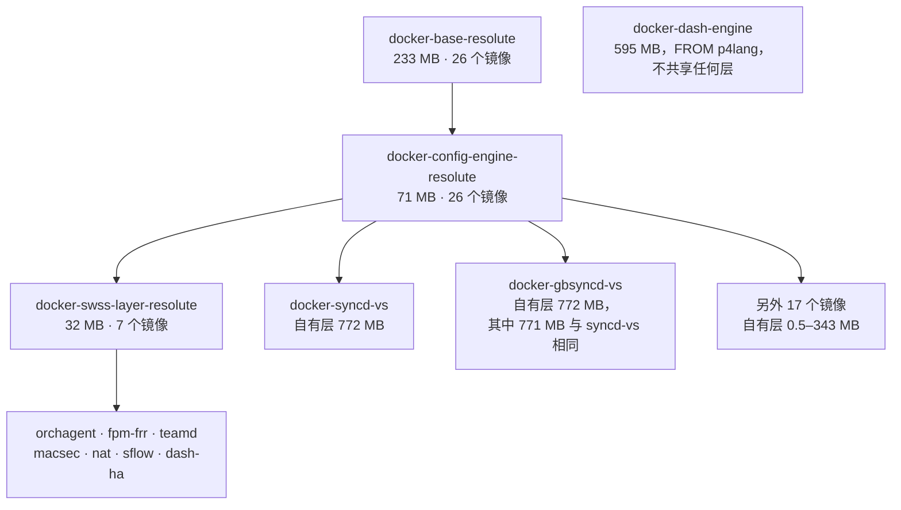
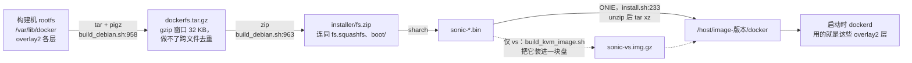
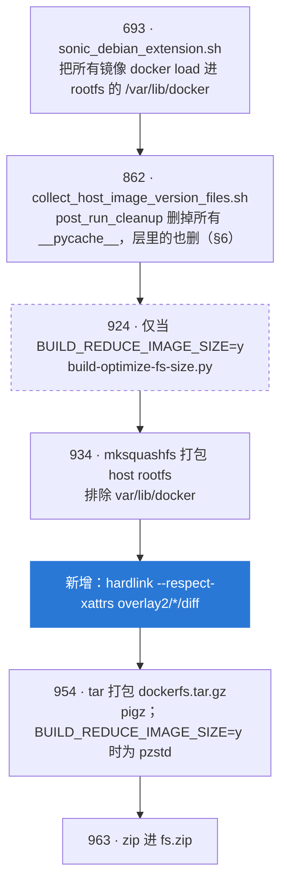
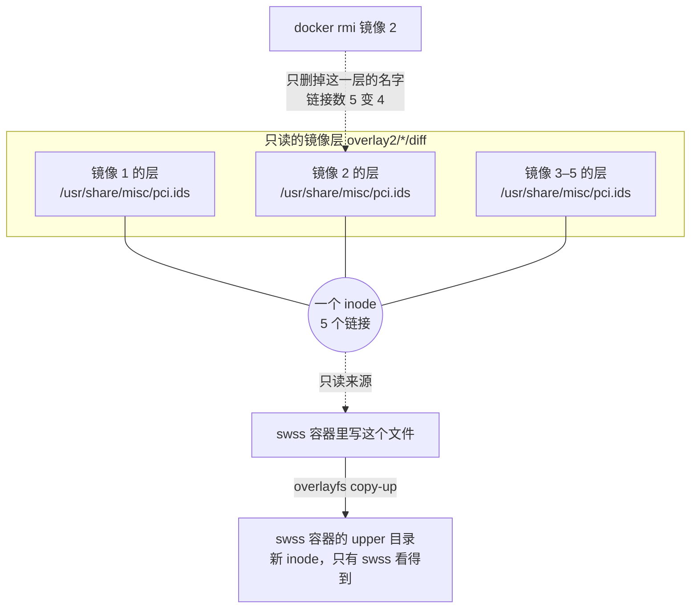
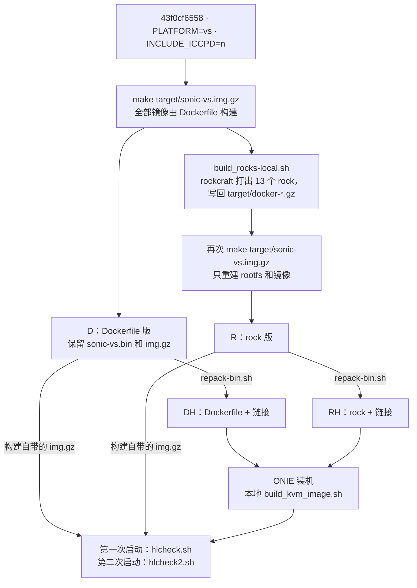
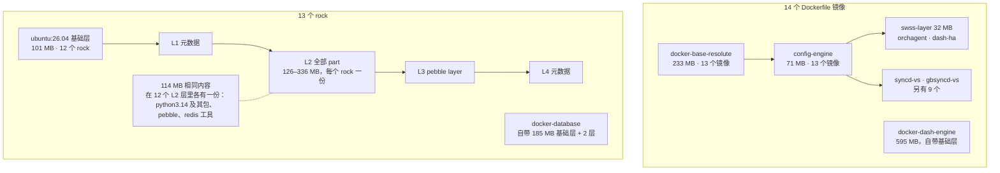
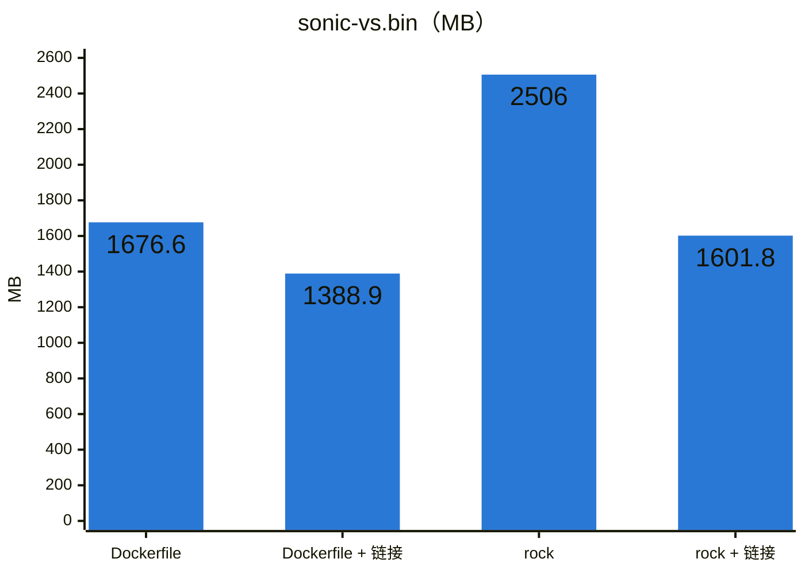
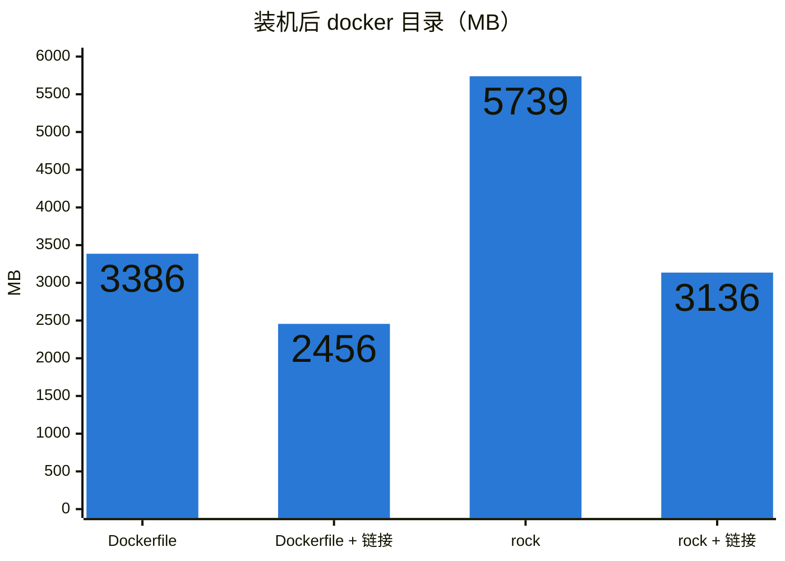
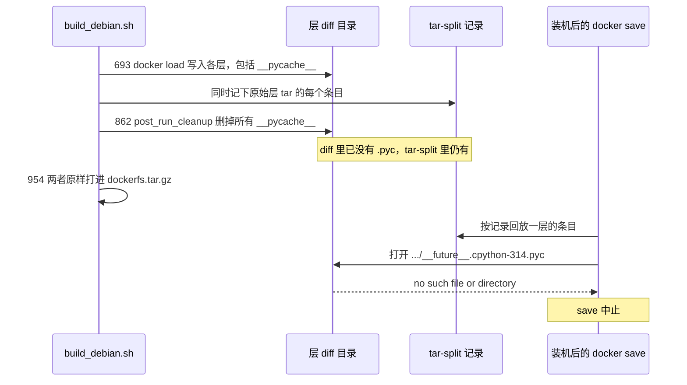
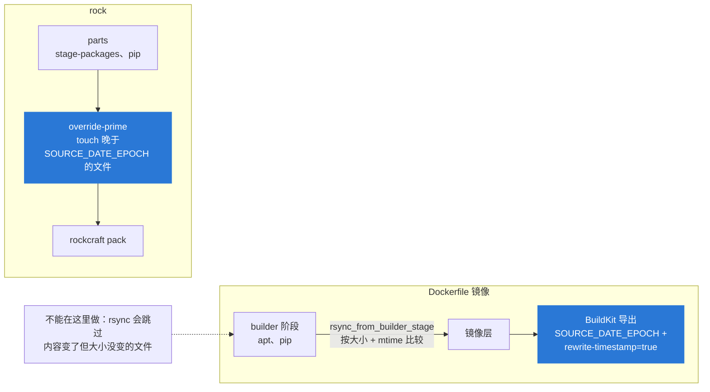

# SONiC docker 镜像间的重复文件：实测与硬链接修法

- 日期：2026-09-29
- 测量的镜像（均为 amd64）：
  - resolute broadcom：2026-09-17 增量构建、PR #14 CI 构建（`c05f0e016`）、2026-08-23 从零构建（`2957b9e3`）
  - resolute vs：2026-08-23 从零构建（`2957b9e3`）和 2026-08-27 构建
  - 官方上游 202605 broadcom：Azure 构建 20260928.6（`6aec5bee6`，build id 1232715）
  - **同一 commit 的 Dockerfile 版与 rock 版 vs 镜像**，都在本地从 `test/rock-merge-resolute` `43f0cf6558` 构建，镜像版本 `test_rock-merge-resolute.0-43f0cf65`。这个 commit 是把 `canonical/202605_resolute` `d2f9ae8502` 合并进 `canonical/202605_resolute_rock` `1d187fd351`。
- 改动：本地分支 `feat/dockerfs-hardlink`，在 `d2f9ae8502` 之上一个签名提交 `6dc4a02257`，未推送
- 工具与原始结果：[data/2026-09-29-docker-layer-dedup/](data/2026-09-29-docker-layer-dedup/)
- 本文为中文版；英文版为唯一事实来源（`-en.md`）

## 0. 结论

- **SONiC 的 docker 镜像并没有压成单层。** 每个 Dockerfile 在父镜像之上加一层，共享的父层 overlay2 只存一份（§1）。
- **重复来自兄弟镜像。** 没有共同父层的镜像，各自往自己的层里装同样的文件。
  - resolute broadcom：重复 242 MB，占全部层内容的 12%。
  - resolute vs：969 MB，29%，大头是 syncd-vs 和 gbsyncd-vs 带着同一套工具链。
  - 官方上游 broadcom：241 MB，11.8%。上游有同样的问题，量级也一样（§2）。
  - rock 版 vs：3126 MB，55.5%（§5）。
- **代价在哪里。** gzip 做不了跨文件去重，所以重复部分在 `.bin` 里占压缩后的大小，装机后在盘上占完整大小。
- **修法不需要抽公共父镜像。** 在打包 `dockerfs.tar.gz` 之前对 `overlay2/*/diff` 跑一遍 util-linux `hardlink`，`build_debian.sh` 里加一行即可（§3）。
  - 上游已有一个可选开关 `BUILD_REDUCE_IMAGE_SIZE`（默认 `n`），它调用的脚本也会对 docker 目录做硬链接。在同样的镜像上，它省下的和 `hardlink -t` 一样多；在 rock 版上比 `hardlink` 默认模式省得多（790 对 961 MB）。它改动的元数据，我们没有找到实际影响（§3）。
  - 但在 ONIE 平台上不能直接打开。同一个开关会把 `dockerfs.tar.gz` 改用 pzstd 压缩，这样打包的镜像无法从 ONIE 安装（§3）。
- **vs 上同一 commit 的四相对比**（§5）：Dockerfile 版和 rock 版，各自分链接与不链接两种，全部来自 `43f0cf6558`，全部走 ONIE 装机。

  | | Dockerfile | Dockerfile + 链接 | rock | rock + 链接 |
  |---|---|---|---|---|
  | `.bin` | 1676.6 MB | 1388.9 MB | 2506.0 MB | 1601.8 MB |
  | 装机后 docker 目录 | 3386 MB | 2456 MB | 5739 MB | 3136 MB |

  - 链接把 rock 版相对 Dockerfile 版多出的部分，在 `.bin` 里从 829 MB 降到 213 MB，在盘上从 2353 MB 降到 680 MB。
  - 链接后的 rock 版比现在不链接的 Dockerfile 版还小。
  - 四个镜像启动后状态相同，检查项全部一致。
- **装好的系统上，rock 镜像无法 `docker save`**（§6）。这和链接无关，问题在两者出现之前就存在。
  - 镜像装进 host rootfs 之后，构建的清理钩子会删掉所有 `__pycache__` 目录，docker 层里的也不例外。
  - 原始 tar 里带 `.pyc` 的层，于是和它的 tar-split 记录对不上了。
  - 受影响的是全部 13 个 rock，外加一个 Dockerfile 镜像 `docker-gnmi-watchdog`。
- **mtime 限制了能链接多少。** `hardlink` 默认要求 mtime 也相同才合并。在 rock 版上，把构建期的 mtime 钳制到 `SOURCE_DATE_EPOCH`，还能再多链接 462 MB（§7）。

## 1. 镜像是怎么存的

**层。** 镜像有两种形态：

- **Dockerfile 镜像。**
  - `docker-base-resolute` 以 `FROM scratch` / `COPY --from=base / /` 结尾，因此是 233 MB 的单层。
  - 其余每个 Dockerfile 都以 `FROM $BASE` 开头，通过 `rsync_from_builder_stage` 宏（`dockers/dockerfile-macros.j2:48-50`）加一层，外加一个空的 `rm /cache.tgz` 层。
  - 链条是 base（233 MB）→ config-engine（09-17 broadcom 构建为 94 MB，vs 上为 71 MB）→ swss-layer（32 MB，7 个镜像共用）→ 镜像自己的层。
  - 父层不管有多少镜像叠在上面都只存一份。如果把每个 broadcom 镜像都压成自包含的单层，总量会是 9828 MB，而现在实际存的是 2018 MB。
- **rock 镜像**的形态不同，见 §5。

vs `43f0cf6558` 构建里的 Dockerfile 链：



**存储路径。**

- **`.bin`。** `sonic-*.bin` → `installer/fs.zip` → `dockerfs.tar.gz`。最后这个文件是构建时整个 `/var/lib/docker` 的 pigz tar：overlay2 各层目录加上镜像元数据（`build_debian.sh:954-963`）。
- **装好的盘。** 在装好的盘上（包括 vs 的 `img.gz`），`installer/install.sh:233` 把它解到 `/host/image-<version>/docker`。
- **两种形态都不做跨层去重。**



## 2. 重复了多少

「重复」指普通文件的内容（sha256）已经在层集合里别处出现过的那部分字节。「被遮蔽」指同一镜像中，被上层覆盖的下层文件的字节：它们照样存储，却永远看不到。

| 镜像 | 层内容 | 重复 | 被遮蔽 |
|---|---|---|---|
| resolute broadcom，2026-09-17 增量 | 2018 MB | **242 MB（12.0%）** | 43 MB |
| resolute broadcom，PR #14 CI 构建 | 1986 MB | 227 MB（11.4%） | 19 MB |
| resolute broadcom，2026-08-23 从零 | 1989 MB | 226 MB（11.3%） | 1.5 MB |
| **官方上游 202605 broadcom** | 2043 MB | **241 MB（11.8%）** | 3.6 MB |
| resolute vs，Dockerfile，`43f0cf6558` | 3388 MB | **969 MB（28.6%）** | 19.3 MB |
| resolute vs，rock，`43f0cf6558` | 5632 MB | **3126 MB（55.5%）** | 29.7 MB |

重复的字节是什么（2026-09-17 broadcom）：

- 205.7 MB 是兄弟层或无关层里的同一路径：两个镜像各自装了同一个包。
- 18.4 MB 是同样的内容换了个路径。
- 17.9 MB 是镜像自己的祖先层里已经有了、又复制了一遍的文件。

最大的几项：

| 浪费 | 份数 | 文件 |
|---|---|---|
| 15.8 MB | ×6 | `libprotobuf.so.32` |
| 13.7 MB | ×5 | `libsaimetadata.so` |
| 12.5 MB | ×3 | `libc.a` |
| 10.0 MB | ×3 | `libsystemd-shared-259.so` |
| 9.6 MB | ×4 | `/usr/bin/syncd`（syncd-brcm 加三个 gbsyncd 镜像） |
| 7.2 MB | ×5 | `libsairedis.so` |
| 6.3 MB | ×5 | `/usr/share/misc/pci.ids` |

上游的清单一样，另外还有约 22 份 buildinfo 的 `copyrights.tar.gz`。vs 上 969 MB 里有 771 MB 来自 docker-syncd-vs 和 docker-gbsyncd-vs，两者都带着 LLVM 21、clang、gcc 的 `cc1` 和 gRPC 静态库。

**被遮蔽字节反映版本是否钉住。** 09-17 构建里，`docker-base-resolute` 用的是 09-03 的缓存，config-engine 是 09-17 构建的。其间 apt 升级了 `libc6` 和 `python3.14`，于是 base 层里的旧副本仍存储在新副本之下。CI 构建在一次运行之内也有同样的漂移（19 MB）。上游钉住了 deb 版本（§7），只有 3.6 MB。

**各形态下的代价**，以 09-17 broadcom 构建为例：

- **`.bin`：** `dockerfs.tar.gz` 为 555 MB。把重复存成 tar 链接后是 486 MB，所以重复在压缩后占 69 MB。若用单流 `zstd --long=31`，重复只占 0.2 MB，但这会改变 ONIE 安装器要读的格式。
- **盘上：** 占完整大小，按 4 KiB 块取整后 265 MB。
- **宿主 rootfs：** 宿主 rootfs 里还有 306 MB 与 docker 层中的文件逐字节相同。那是两个独立的压缩包，这些工具链接不了。

## 3. 修法：打包前硬链接

```sh
## Hardlink identical files across docker image layers; tar keeps the links
sudo bash -c "hardlink --respect-xattrs $FILESYSTEM_ROOT/${DOCKERFS_PATH}var/lib/docker/overlay2/*/diff"
```

这一行放在 `build_debian.sh` 里紧挨 `## Compress docker files` 之前。slave 镜像里已经有 util-linux 2.41.3 的 `hardlink`。`build_debian.sh` 里涉及 docker 目录的步骤，按行号排列：



为什么安全：

- **tar。** GNU tar 把同一 inode 的第二个及以后的名字写成链接条目，ONIE 里的 busybox tar 解包时会还原成链接。
- **overlayfs。** 下层对容器只读。容器里的写、`chmod` 或 `rm` 会把文件 copy-up 到该容器自己的 upper 目录，共享的 inode 不受影响。
- **`docker save`** 按每层的 tar-split 记录重建层 tar，文件内容按路径去读。链接既不改路径也不改内容，所以层 digest 不变。
- **`docker rmi`** 删的是层目录。一个文件只要还被别的层链接着，inode 就保留。
- **合并规则。** `hardlink` 只合并内容、mode、属主以及（加 `--respect-xattrs` 时）扩展属性都相同的文件。默认还要求 mtime 相同，`-t` 去掉 mtime 检查。
  - 构建出来的镜像，docker 层里没有 `.pyc` 文件：host-image 的清理步骤把它们删了（§6）。因此 `-t` 不可能让层里的字节码缓存变得过期。
  - 但 `-t` 确实会让一些文件报告的 mtime 与构建时的不同。

一个被链接的文件在运行时的情况：



省下多少：

| 镜像 | 测量项 | 之前 | 之后 |
|---|---|---|---|
| resolute broadcom 09-17 | 层占用的 ext4 | 2011 MB | 1790 MB |
| resolute broadcom 09-17 | `dockerfs.tar.gz` | 555 MB | 493 MB（重复全部链接时 486 MB） |
| 官方 202605 broadcom | `dockerfs.tar.gz`，重复全部链接 | 593 MB | 507 MB |
| resolute vs 08-23 | `dockerfs.tar.gz` / 装机后 docker 目录 | 1025.6 / 3356 MB | 742.1 / 2442 MB（§4） |
| resolute vs Dockerfile `43f0cf6558` | `dockerfs.tar.gz` / 装机后 docker 目录 | 1035.8 / 3386 MB | 748.0 / 2456 MB（§5） |
| resolute vs rock `43f0cf6558` | `dockerfs.tar.gz` / 装机后 docker 目录 | 1865.2 / 5739 MB | 960.9 / 3136 MB（§5） |

broadcom 的 242 MB 重复里，默认模式链接了 214 MB；官方镜像 241 MB 里链接了 202 MB。其余内容相同但 mtime 不同（§7）。

**上游的可选开关：`BUILD_REDUCE_IMAGE_SIZE`。** 上游 PR #16729（2023）加入了 `scripts/build-optimize-fs-size.py`。`rules/config:394` 把这个开关默认设为 `n`。设为 `y` 时，`build_debian.sh:924-932` 会带 `--hardlinks var/lib/docker`、`--hardlinks usr/share/sonic/device` 以及删除文档、man 手册和许可证的选项调用这个脚本。同一个开关还会：

- 把 `dockerfs.tar.gz` 改用 pzstd 压缩（`build_debian.sh:955-956`，由 #21852 为 Aboot slim 镜像加入）；
- 在 host 上跳过安装 `sonic-rsyslog-plugin`（`sonic_debian_extension.j2:404`），并从 `00-sonic.conf.j2` 里去掉它的 `omprog` action；
- 对 Aboot 镜像，还会删除非 Arista 的平台目录、部分内核模块和固件。

在 `43f0cf6558` 镜像的 dockerfs 上直接跑了这个脚本（`upstream-opt.sh`），并与 `hardlink`（`repack-bin.sh`）对比。`dockerfs.tar.gz`，单位 MB：

| | 未链接 | `hardlink --respect-xattrs` | `hardlink --respect-xattrs -t` | 上游脚本，只链接 | 上游脚本，链接 + 删除 | 同上，pzstd |
|---|---|---|---|---|---|---|
| Dockerfile | 1035.8 | 748.0 | 740.7 | 743.3 | 741.8 | 699.3 |
| rock | 1865.2 | 960.9 | 788.3 | 790.3 | 778.0 | 734.3 |

- **链接。** 这个脚本按「文件名 + md5」分组，不看 mode、属主和 mtime。在 rock 版上，它比 `hardlink` 默认模式多出来的收益全部来自不比较 mtime；`hardlink -t` 也能拿到同样的收益。
- **元数据。** 每链接一个文件，它就把被链接文件的 mode 和属主设到共享的 inode 上。先 `chmod` 后 `chown` 还会清掉 setuid 和 setgid，Linux 上即使是 root 调用也会清。
  - 在 rock 版上，这清掉了 16 个 setuid/setgid 位（`passwd`、`chfn`、`chsh`、`gpasswd`、`mount`、`umount`；setgid 的 `chage`、`expiry`、`unix_chkpwd`、`pam_extrausers_chkpwd`），改了 19 处可执行位和 34 处属主。在 Dockerfile 版上：没有 setuid 或 setgid，可执行位 3 处，属主 29 处。
  - 这些改动我们都没有找到实际影响。setuid 和 setgid 程序只在容器里由非 root 用户运行时才有意义，而 SONiC 容器的进程都以 root 运行。
  - `k8s_pod_control.sh` 在两个 sidecar 镜像里从 755 变成 644。真正被执行的是 host 上的那份，`sidecar_common.SyncItem` 写到 host 时用的是 mode 0o755。
  - 其余的是一些 Python 文件的属组（在一个镜像里是 root，在另一个里是 staff）、`/etc/skel` 下的文件、一个 YANG 文件和一个 apport 钩子。
- **删除选项。** 在 rock 层里省 12 MB，在 Dockerfile 层里省 1.5 MB。host rootfs 本来就没有 `/usr/share/doc`（`build_debian.sh:881`），也没有 man 手册，`common-licenses` 只有 0.2 MB。
- **pzstd 让 ONIE 装不上。** `installer/install.sh:233`（上游 master 里是 239 行）用 `tar xz` 解开 `dockerfs.tar.gz`。只有两条路径能识别 zstd：initramfs 的延迟解包（`union-mount.j2:142-149`，供 Aboot 的 docker-in-RAM 使用）和 DSC 安装器。#21852 把 ONIE 镜像留到了以后。
  - 一个只把 dockerfs 改用 pzstd 重新压缩的 Dockerfile 版 `.bin`，每一次 ONIE 安装都失败，报 `tar: invalid magic` 和 `Failure: Unable to install image`。
  - 单看 pzstd，还能再省 43–44 MB。
- **rsyslog。** 没有 `sonic-rsyslog-plugin`，host 就不再向事件框架发布 BGP 日志事件。eventd 启动时仍会把 `host_events.conf` 拷到 host（`docker_image_ctl.j2:408`），而这个文件用到了 `omprog` 和 `/usr/bin/rsyslog_plugin`。开关打开时 rsyslog 会怎样处理，还没有测过。

所以这个脚本链接的量和 `hardlink -t` 一样，其余改动要么很小，要么是有意为之的取舍。在安装器能解开 zstd 格式的 dockerfs 之前，ONIE 平台不能打开这个开关。可行的路有三条：

- 打开开关，同时让 `install.sh` 能解 zstd，或者像 Aboot 那样把压缩包留给 initramfs 去解；
- 打开开关，但 ONIE 镜像仍用 pigz；
- 保留 `build_debian.sh` 里那一行，加上 `-t` 拿到全部收益。

## 4. vs 上的端到端检查

**方法。**

- **基线镜像。** 2026-08-23 从零构建产出的 `sonic-vs.bin`（`202605_resolute_sheldon.0-2957b9e3`）。
- **硬链接版。** 通过重新打包这个文件得到，没有重新构建（`repack-bin.sh`）：
  - 解出 payload，用 `--numeric-owner` 解开 `dockerfs.tar.gz`，跑 `hardlink`，用 pigz 重新打 tar 并更新 `fs.zip`；
  - 改写 sharch 头里的 `payload_image_size` 和 `payload_sha1`。
- **装机。** 两个镜像都用 `scripts/build_kvm_image.sh` 的本地副本走了真实的 ONIE 装机。副本删掉了 `apt-get` 那一行，VNC 和 SSH 转发只绑 127.0.0.1。
- **健康检查。** 由注入的一次性 systemd 单元（`hlcheck.sh`）完成：结果写到 `/host`，然后关机。交互式串口会话在首次启动时从第二条命令起就不再响应，两个镜像都如此。

**大小。**

| | 未改动 | 硬链接 |
|---|---|---|
| `dockerfs.tar.gz` | 1025.6 MB | 742.1 MB（−27.6%） |
| `sonic-vs.bin` | 2663.9 MB | 2380.4 MB |
| 装机后 `/host/image-*/docker` | 3356 MB | 2442 MB |
| SONiC-OS 分区已用 | 4932 MB | 4017 MB |
| `sonic-vs.img.gz` | 2679.6 MB | 2395.6 MB |

**内容。** 装机后 52,090 个普通文件的内容、mode、属主、mtime 全部一致。唯一的差别是 4,029 个符号链接的 mtime，这是解包再打包的副产物。

**行为**（`result-a.txt` 为硬链接版，`result-b.txt` 为未改动版）：

| 检查项 | 两个镜像 |
|---|---|
| 容器 | 14 个在跑，集合相同（bgp、database、eventd、gbsyncd、gnmi、lldp、mgmt-framework、pmon、radv、snmp、swss、syncd、sysmgr、teamd） |
| ASIC_DB | 33 个 PORT、69 个 ROUTE_ENTRY；PORT_TABLE 里 32 个端口，PortInitDone 已置位 |
| BGP | 配置了 32 个邻居 |
| 失败单元 | `system-health` 和 `watchdog-control`，每个 vs 镜像上都会失败 |
| Copy-up | `/usr/share/misc/pci.ids` 在硬链接版里是一个 inode、5 个链接，在另一个里是 5 个独立 inode。在 swss 里往它末尾追加内容，只改了 swss 里的那份；bgp、lldp、pmon、snmp 以及五个层文件都没变 |
| `docker save` | docker-orchagent、docker-syncd-vs、docker-fpm-frr 的层 sha256 都等于 `rootfs.diff_ids` |
| `systemctl restart swss`，然后 `config reload` | 14 个容器全部恢复，33 个端口，失败单元相同 |
| syslog ERR 行 | 两边消息相同 |

**删除镜像**（`hlcheck2.sh`，`result2-*.txt`）：

- `docker rmi` 掉 feature 未启用的六个镜像（dhcp-relay、macsec、nat、sflow、mux、sonic-otel），删除了 2,731 个层文件，其中 2,075 个是硬链接。
- 剩下的文件里有 4,098 个曾与被删文件共用 inode，内容全部保持原样。
- 其余文件都没有变化。之后 `config reload` 恢复出相同的端口、路由和 BGP 邻居。

## 5. 同一 commit 的四相对比：Dockerfile 或 rock，链接或不链接

**构建。** 同一份 `43f0cf6558` 的检出（`PLATFORM=vs`、`INCLUDE_ICCPD=n`）产出了两个基础镜像：

1. `make target/sonic-vs.img.gz` 用 Dockerfile 构建全部镜像。这一轮的 `sonic-vs.bin` 和 `sonic-vs.img.gz` 留作 **Dockerfile** 版。
2. `build_rocks.sh` 用 rockcraft 打出 rock 镜像，写回同样的 `target/docker-*.gz`。实际跑的是一份本地副本（`build_rocks-local.patch`），改了两处，都不影响镜像内容：
   - 每次 pack 之后执行 `rockcraft clean`，否则每个 LXD 构建实例都会在盘上留一整套根文件系统。
   - 不打 `docker-iccpd`。`INCLUDE_ICCPD=n` 时两个版本都不装它。
3. 再执行一次 `make target/sonic-vs.img.gz`，只重建了根文件系统和镜像本身，得到 **rock** 版。没有任何 rock 镜像被 Dockerfile 重新构建覆盖。

两个链接版由 `repack-bin.sh` 生成。两个不链接版用的就是构建自带的 `img.gz`。链接版用和 §4 相同的 `build_kvm_image.sh` 副本走了同样的 ONIE 装机。



**镜像集合。** 两个版本都带同样的 27 个镜像。rock 版里其中 13 个是 rock，entrypoint 都是 `pebble enter`，history 里都有 `umoci`：

> database、eventd、fpm-frr、lldp、macsec、nat、platform-monitor、router-advertiser、sflow、snmp、sonic-gnmi、sonic-mgmt-framework、teamd

**rock 的层形态。** 每个 rock 有五层：`ubuntu:26.04` 基础层（L0）、`/.rock/metadata.yaml`（L1）、一个装下所有 part 的层（L2）、pebble 的 layer YAML（L3），以及又一个 `metadata.yaml`（L4）。docker-database 只有三层，带着自己的 185 MB 基础层。rock 版的镜像：



rock 之间、rock 与 Dockerfile 链之间都没有父子关系。每个 L2 层都 stage 了自己的一整套运行时，而 Dockerfile 镜像是从 config-engine 和 swss-layer 各拿一份。rock 版 3.1 GB 重复里约有 2.1 GB 落在 13 个 rock 自己的层里，另有 114 MB 内容在使用共享基础层的 12 个 L2 层里各有一份。

**大小**（`measure.sh`）。

| | Dockerfile | Dockerfile + 链接 | rock | rock + 链接 |
|---|---|---|---|---|
| `dockerfs.tar.gz` | 1035.8 MB | 748.0 MB（−27.8%） | 1865.2 MB | 960.9 MB（−48.5%） |
| `sonic-vs.bin` | 1676.6 MB | 1388.9 MB（−17.2%） | 2506.0 MB | 1601.8 MB（−36.1%） |
| 装机后 docker 目录 | 3386 MB | 2456 MB（−27.5%） | 5739 MB | 3136 MB（−45.4%） |
| SONiC-OS 分区已用 | 4009 MB | 3079 MB | 6362 MB | 3758 MB |
| `sonic-vs.img.gz` | 1693.0 MB | 1404.6 MB（−17.0%） | 2524.0 MB | 1618.0 MB（−35.9%） |





**链接对 rock 额外开销的影响：**

| rock 减 Dockerfile | 未链接 | 链接后 |
|---|---|---|
| `.bin` | +829.4 MB | +212.9 MB |
| 装机后 docker 目录 | +2353 MB | +680 MB |

- 两个版本去重后的独有内容只差 87 MB（2506.2 对 2419.5 MB）。
- 链接后剩下的 680 MB，大部分是默认模式因为 mtime 不同而没有链接的重复内容：rock 版有 548 MB，Dockerfile 版只有 29 MB（§7）。
- 其余是目录项：每个 rock 层都带一整棵目录树，而目录不能链接。

**行为。** 四个镜像跑的是同一套 `hlcheck.sh` 和 `hlcheck2.sh`（`results/four-way/`）：

| 检查项 | 四个镜像 |
|---|---|
| 容器 | 相同的 14 个在跑 |
| ASIC_DB | 33 个 PORT、69 个 ROUTE_ENTRY；PORT_TABLE 里 32 个端口，PortInitDone 已置位 |
| BGP | 配置了 32 个邻居 |
| 失败单元 | `system-health` 和 `watchdog-control` |
| Copy-up | 两个链接版里 `pci.ids` 是一个 inode、5 个链接，两个不链接版里是 5 个独立 inode。在 swss 里追加内容只改了 swss 那份 |
| `docker save` | docker-orchagent（8 层）和 docker-syncd-vs（6 层）在四个镜像上都与 `diff_ids` 一致。docker-fpm-frr 在两个 Dockerfile 版上一致，在两个 rock 版上以同样的方式失败（§6） |
| `restart swss`，然后 `config reload` | 14 个容器全部恢复，33 个端口 |
| `docker rmi` 六个未启用的镜像 | Dockerfile：删除 2,730 个层文件。Dockerfile + 链接：其中 2,074 个是链接，剩下的文件里有 4,044 个曾与被删文件共用 inode。rock：删除 15,015 个（macsec、nat、sflow 是 rock）。rock + 链接：其中 12,338 个是链接，33,899 个曾共用 inode。四个版本里其余文件都没有变化，`config reload` 恢复出相同的端口、路由和邻居 |

每一对之间，syslog ERR 行只差几条是否出现取决于时序的消息：reload 期间 rsyslog 经 RELP 往宿主转发失败、`fdbsyncd` 的 netlink 读取错误，以及 `mgmtd` 的锁。这些消息在不链接镜像的运行里同样会出现。

## 6. 发现：host-image 的 `.pyc` 清理让 `docker save` 失效

`src/sonic-build-hooks/scripts/post_run_cleanup:30` 会执行 `find / | grep -E "__pycache__" | xargs rm -rf`。host image 通过 `scripts/collect_host_image_version_files.sh:26` 在 chroot 里运行这个钩子。过程如下，行号来自 `build_debian.sh`：



所以这次清理也会删掉每个已 load 层里的每个 `__pycache__`。这就是测过的镜像层里都没有 `.pyc` 的原因。

**对 `docker save` 的影响。** docker 为每一层保存一份原始 tar 的 tar-split 记录。`docker save` 按这份记录回放，并从挂载的层里读取每个文件的内容。原始 tar 里有 `.pyc` 的层，这些文件现在不存在了，于是 save 中止，报 `open …/merged/usr/lib/python3.14/__pycache__/…pyc: no such file or directory`。根据 `dockerfs.tar.gz` 里的 tar-split 记录统计出的受影响镜像：

| 版本 | 层 tar 里记录了、却被构建删掉的 `.pyc` 所在镜像 |
|---|---|
| Dockerfile | `docker-gnmi-watchdog`（349 个文件） |
| rock | 全部 13 个 rock（每个 462–1,412 个文件）以及 `docker-gnmi-watchdog` |

- 失败是在两个 rock 版上对 docker-fpm-frr 实际观察到的，与链接无关。
- 其他镜像是根据同样缺失的文件推断出来的，没有实际运行。
- 需要重建原始层 tar 的其他操作也会受影响，例如 `docker push`。
- rock 容器启动时还会把 Python 标准库重新编译到各自的可写层里。启动一次后，有 11 个容器层里出现了这样的 `.pyc`。

以下任一改动都能修复：
- host-image 的清理跳过 `/var/lib/docker`；
- 让层 tar 不再带 `__pycache__`，例如在每个 rock 的 `override-prime` 里删掉它。

## 7. mtime 与可复现构建

内容相同的文件过不了默认的 mtime 检查，原因有两个：

1. **构建期安装。** 构建过程中写出的文件带着写出时的时间：pip 安装、dpkg 和 debconf 状态、buildinfo。修法是把所有晚于 `SOURCE_DATE_EPOCH` 的 mtime 钳制为它。
2. **版本漂移。** 不同镜像装了同一个包的不同版本。修法是钉住包版本。

每一步能收回多少：

| | 默认模式 | 钳制后 | 上限（`-t`） |
|---|---|---|---|
| resolute broadcom 09-17 | 214 MB | 226 MB | 242 MB |
| resolute broadcom 08-23 从零 | — | 224.8 MB | 225.6 MB |
| 官方 202605 broadcom（版本已钉） | 202 MB | 239 MB | 240 MB |
| resolute vs Dockerfile `43f0cf6558` | 939.9 MB | 955.1 MB | 968.4 MB |
| resolute vs rock `43f0cf6558` | 2576.9 MB | 3039.2 MB | 3125.3 MB |

钳制要在哪里做：

- **Dockerfile 镜像：在 BuildKit 导出时。** 也就是 `SOURCE_DATE_EPOCH` 构建参数加 `rewrite-timestamp=true`；slave 里是 docker 29.6.1 和 buildx 0.35。不能在 rsync 层之前的 builder 阶段做。`rsync` 按大小和 mtime 比较，一个改了内容但大小没变的文件会被静默跳过。
  - `Makefile.work:295-304` 已经定义了 `SOURCE_DATE_EPOCH`（为 SBOM 引入），并导出到 slave 容器里。
  - `slave.mk` 没有把它传给 `docker build`。
- **rock：在 `override-prime` 里。** 在那里把所有晚于 `SOURCE_DATE_EPOCH` 的文件 touch 一遍，就能覆盖占 rock 差距大头的 pip 安装包。

两类镜像各自可以在哪里钳制：



**钉版本。**
- **上游。** 官方流水线（`.azure-pipelines/azure-pipelines-Official.yml:24`）用 `SONIC_VERSION_CONTROL_COMPONENTS=deb,py2,py3,web` 构建。`rules/config:332-334` 据此把 `MIRROR_SNAPSHOT` 设为 `y`，所有 apt 操作都读同一个归档快照。
- **resolute。** `rules/config:306` 已经把 `BUILD_SNAPSHOT_URL` 指向 snapshot.ubuntu.com。但本地构建和 `.github/workflows/resolute-build.yml` 都没有在 `SONIC_VERSION_CONTROL_COMPONENTS` 里包含 `deb`，所以 `MIRROR_SNAPSHOT` 仍是 `n`，apt 读的是实时归档。快照这条路在 resolute 上能否端到端走通，还没有测过。

钳制和钉版本不是硬链接改动的前提。它们能提高收益，并让结果不再取决于各个镜像碰巧在什么时候构建。

## 8. 未完成

- 硬链接改动是本地提交，还没开 PR。采用 `-t`，还是改安装器后采用 `BUILD_REDUCE_IMAGE_SIZE`，尚未决定。
- 没有启动过用 `-t` 或上游脚本链接的镜像。它们的大小来自对 `.bin` 的重新打包。
- `BUILD_REDUCE_IMAGE_SIZE=y` 时 host 上 rsyslog 的表现没有测过。
- 导出时钳制和 `override-prime` 钳制只做了模拟测量（`mtime_report.py`），都没实现。
- `.pyc` 清理的问题（§6）没有修。`docker save` 只对 docker-fpm-frr 实际运行过。
- broadcom 的数字来自对镜像的分析。没有把链接后的 broadcom 镜像装到硬件或 VM 上。
